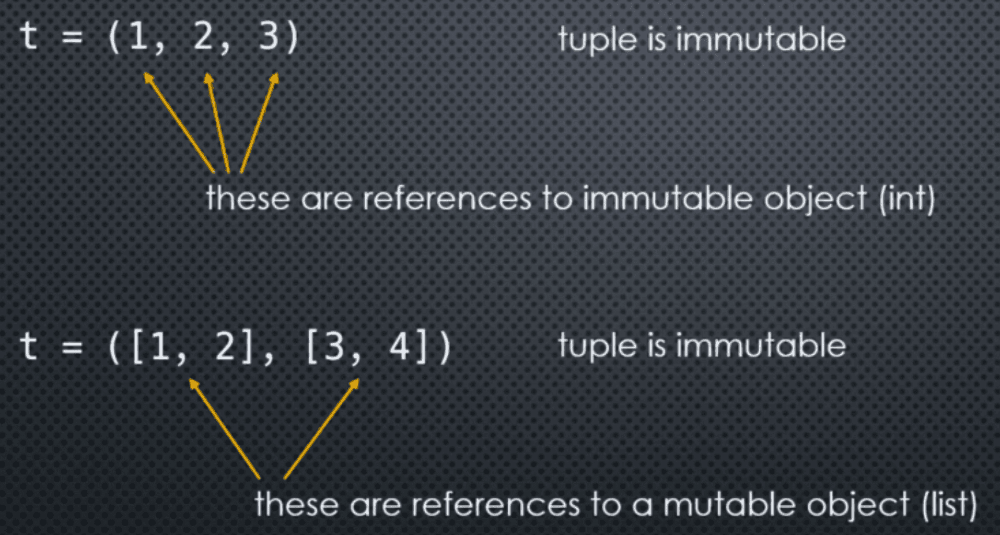

Let's consider an object in memory:

```markdown
|  type  | -> 0x1000
|        | 
|  state |
|  data  |
```

Changing the data **inside** the object is called *modifying the internal state* of the object. For example:

```markdown
| BankAccount   | -> 0x1000
|               | 
| Acct#: 12345  | -> my_account
| Balance: 150  |
```

Suppose we modify the balance:

```markdown
| BankAccount   | -> 0x1000
|               | 
| Acct#: 12345  | -> my_account
| Balance: 500  |
```

Here, the internal state (data) has *changed*, but the memory address is not changed. Unlike when we're dealing with **integers**. We can say the object was **mutated**

An object whose internal state **can** be changed, is called **Mutable**
An object whose internal state **cannot** be changed, is called **Immutable**

___
### Examples in Python
#### Immutable

- All numbers (int, float, Booleans, etc)
- Strings
- Tuples
- Frozen Sets
- User-Defined Classes
#### Mutable

- Lists
- Sets 
- Dictionaries
- User-Defined Classes

___
### Word of Warning 

```python
t = (1, 2, 3, 4)
```

Here, this tuple is *immutable* which means elements *cannot* be deleted, inserted, or replaced. In this case, both the container (tuple), and all its elements (ints) are immutable

But now consider this:

```python
a = [1, 2]
b = [3, 4] #List are mutable: elements can be deleted, insertedm or replaced
t = (a, b)
```

```python
a = [1, 2]
b = [3, 4]
t = (a, b)
```

Now, we gotta be a little careful here since we can add values to this list:

```python
a.append(3)
b.append(5)

print(t)
```

In this case, although the tuple is immutable, its *elements are not*.
The object references in the tuple *did not* change, but the *referenced objects did mutate!*



___
### Code Example:

```python
my_list = [1, 2, 3]

print(type(my_list))
print(id(my_list))

my_list.append(4)

print(id(my_list))
```

```python
my_list_1 = [1, 2, 3]

print(id(my_list_1))

my_list_1 = my_list_1 + [4]

print(id(my_list_1))
```

Here, this code above is not modifying the my_list_1. I mean, the memory address. For that you need the append method.

___


