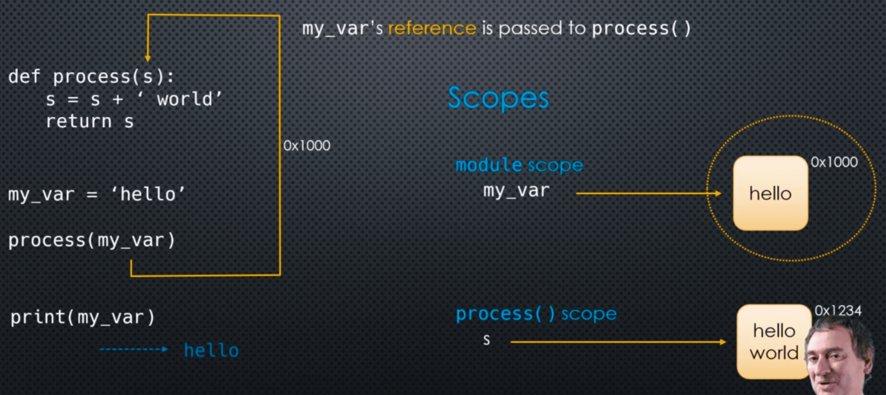
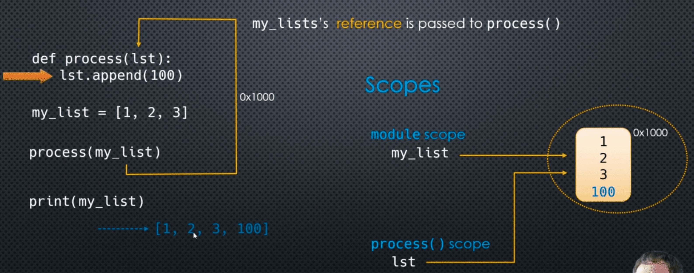
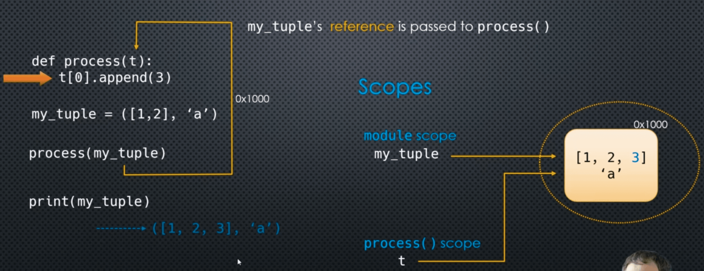

In Python, (**str**) are **immutable** object.

Once a string has been created, the contents of the object can **never** be changed for example:

```python
my_var = "hello"
```

The only way to modify the "value" of ```my_var``` is to **re-assign** my_var to **another** object.
### Immutable objects are safe from unintended side-effects

```python
def process(s):
    s = s + ' world'
    return s 

my_var = 'hello'
```



However, we do have to watch out for immutable collection objects that contains mutable objects

___
### Mutable objects are **not** safe from unintended side-effects

```python
def process(lst):
    lst.append(100)

my_list = [1, 2, 3]
```



___
### Immutable collections objects that contain mutable objects 

```python
def process(t):
    t[0].append(3)
```



___
### Code Example

```python
def process(s):
    print('Initial s# = {0}'.format(id(s)))
    s = s + ' world'
    print('Final s# = {0}'.format(id(s)))
    print("\n")

my_var = 'hello'
print('my_var# = {0}'.format(id(my_var)))
process(my_var)

print(id(my_var))
print(my_var)
```

```python
def modify_list(lst):
    print('Initial lst# = {0}'.format(id(lst)))
    lst.append(100)
    print('Final lst# = {0}'.format(id(lst)))
    print("\n")

my_list = [1, 2, 3]
print(id(my_list))
modify_list(my_list)
```

```python
def modify_tuple(t):
    print('Initial t# = {0}'.format(id(t)))
    t[0].append(100)
    print('Final t# = {0}'.format(id(t)))
    print("\n")

my_tuple = ([1, 2], [3, 4])
print(id(my_tuple))
modify_list(my_tuple)
```

___
