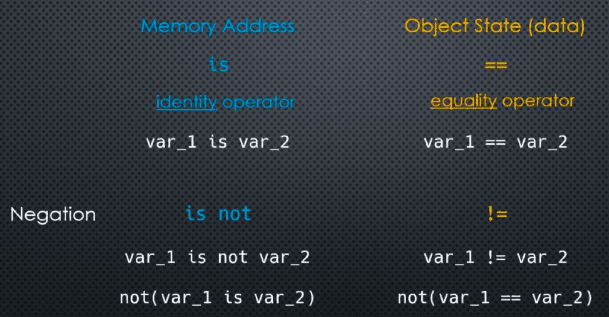

We can think of variable equality in two fundamental ways:



___
### Examples:

```python
a = 10
b = a 

print(a is b)
print(a == b)
```

They both will return ```True``` because firstly they share the same **memory address** and second they also have the same value as '10'.

```python
a = 'hello'
b = 'hello'

print(a is b) # This is True, but don't count on it
print(a == b)
```

```python
a = [1, 2, 3]
b = [1, 2, 3]

print(a is b)
print(a == b)
```

```python
a = 10
b = 10.0

print(a is b)
print(a == b)
```

The **None** object can be assigned to variables to indicate that they are not set (in the way we would expect them to be), i.e. an "empty" value (or null pointer).

But the **None** object is a **real** object that is managed by the Python memory manager. Furthermore, the memory manager will always use a **shared reference** when assigning a variable to **None**.

```python
a = None
b = None # Throughout the lifetime of the application the memory address will be the same for all three variables
c = None
```

So we can test if a variable is "not set" or "empty" by comparing its memory address to the memory address of **None** using the ```is``` operator.

```python
print(a is None)
```

None in Python doesn't mean anything it is an actual object.

```python
x = 10 

print(x is None)
print(x is not None)
```

___
