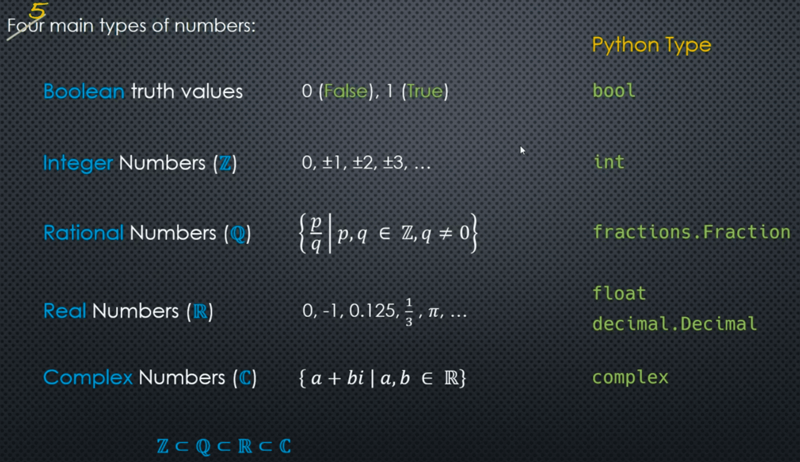

___

| **[3.1.0. Integers Numbers](./3.1.0.Integers%20Numbers.md)** | Obsidian                                                                                                                                                | WebPage     |
| ------------------------------------------------------------ | ------------------------------------------------------------------------------------------------------------------------------------------------------- | ----------- |
| **1.0. How Large can it get?**                               | [Obsidian](./3.1.0.Integers%20Numbers.md#How%20large%20can%20a%20Python%20```int```%20become%20(positive%20or%20negative))                              | [WebPage]() |
| **2.0. 8-bit Representation of 10 base**                     | [Obsidian](./3.1.0.Integers%20Numbers.md#What%20is%20the%20largest%20(base%2010)%20integer%20number%20that%20can%20be%20represented%20using%208%20bits) | [WebPage]() |
| **3.0. Code Example**                                        | [Obsidian](./3.1.0.Integers%20Numbers.md#Code%20Example)                                                                                                | [WebPage]() |

| **[3.1.1.Integers Operations](./3.1.1.Integers%20Operations.md)** | Obsidian                                                                                | WebPage     |
| ----------------------------------------------------------------- | --------------------------------------------------------------------------------------- | ----------- |
| **1.0. Floor Division**                                           | [Obsidian](./3.1.1.Integers%20Operations.md#What%20is%20a%20floor%20division%20exactly) | [WebPage]() |
| **2.0. Negative Numbers**                                         | [Obsidian](./3.1.1.Integers%20Operations.md#Negative%20Numbers)                         | [WebPage]() |
| **3.0. Code Example**                                             | [Obsidian](./3.1.1.Integers%20Operations.md#Code%20Example)                             | [WebPage]() |

| **[3.1.2.Integers Constructors and Bases](./3.1.2.Integers%20Constructors%20and%20Bases.md)** | Obsidian                                                                            | WebPage     |
| --------------------------------------------------------------------------------------------- | ----------------------------------------------------------------------------------- | ----------- |
| **1.0. Number Base**                                                                          | [Obsidian](./3.1.2.Integers%20Constructors%20and%20Bases#Number%20Base)             | [WebPage]() |
| **2.0. Base Change Algorithm**                                                                | [Obsidian](./3.1.2.Integers%20Constructors%20and%20Bases#Base%20Change%20Algorithm) | [WebPage]() |
| **3.0. Encodings**                                                                            | [Obsidian](./3.1.2.Integers%20Constructors%20and%20Bases#Encodings)                 | [WebPage]() |
| **4.0. Code Example**                                                                         | [Obsidian](./3.1.2.Integers%20Constructors%20and%20Bases#Code%20Example)            | [WebPage]() |

___

| **[3.2.0.Rational Numbers](./3.2.0.Rational%20Numbers.md)** | Obsidian                                                                | WebPage     |
| ----------------------------------------------------------- | ----------------------------------------------------------------------- | ----------- |
| **1.0. The Fraction Class**                                 | [Obsidian](./3.2.0.Rational%20Numbers#The%20Fraction%20Class)           | [WebPage]() |
| **2.0. Constructors**                                       | [Obsidian](./3.2.0.Rational%20Numbers#Constructors)                     | [WebPage]() |
| **3.0. Word of Warning**                                    | [Obsidian](./3.2.0.Rational%20Numbers#Word%20of%20Warning)              | [WebPage]() |
| **4.0. Constraining the Denominator**                       | [Obsidian](./3.2.0.Rational%20Numbers#Constraining%20the%20Denominator) | [WebPage]() |
| **5.0. Code Example**                                       | [Obsidian](./3.2.0.Rational%20Numbers#Code%20Example)                   | [WebPage]() |

___

| **[3.3.0.Real Numbers Floats Internal Representation](3.3.0.Real%20Numbers%20Floats%20Internal%20Representation.md)** | Obsidian                                                                                          | WebPage     |
| --------------------------------------------------------------------------------------------------------------------- | ------------------------------------------------------------------------------------------------- | ----------- |
| **1.0. Representation Decimal**                                                                                       | [Obsidian](3.3.0.Real%20Numbers%20Floats%20Internal%20Representation.md#Representation%20Decimal) | [WebPage]() |
| **2.0. Representation Binary **                                                                                       | [Obsidian](3.3.0.Real%20Numbers%20Floats%20Internal%20Representation.md#Representation%20Binary)  | [WebPage]() |
| **3.0. Code Example**                                                                                                 | [Obsidian](3.3.0.Real%20Numbers%20Floats%20Internal%20Representation.md#Code%20Example)           | [WebPage]() |

| **[3.3.1.Floats Equality Testing](./3.3.1.Floats%20Equality%20Testing.md)** | Obsidian                                                                         | WebPage     |
| --------------------------------------------------------------------------- | -------------------------------------------------------------------------------- | ----------- |
| **1.0. Using Absolute Tolerances...**                                       | [Obsidian](./3.3.1.Floats%20Equality%20Testing#Using%20Absolute%20Tolerances...) | [WebPage]() |
| **2.0. Code Example**                                                       | [Obsidian](./3.3.1.Floats%20Equality%20Testing#Code%20Example)                   | [WebPage]() |

| **[3.3.2.Floats Coercing to Integers](./3.3.2.Floats%20Coercing%20to%20Integers.md)** | Obsidian                                                                        | WebPage     |
| ------------------------------------------------------------------------------------- | ------------------------------------------------------------------------------- | ----------- |
| **1.0. Truncation**                                                                   | [Obsidian](./3.3.2.Floats%20Coercing%20to%20Integers#Truncation)                | [WebPage]() |
| 1.1. The `int` Constructor                                                            | [Obsidian](./3.3.2.Floats%20Coercing%20to%20Integers#The%20`int`%20Constructor) | [WebPage]() |
| **2.0. Floor**                                                                        | [Obsidian](./3.3.2.Floats%20Coercing%20to%20Integers#Floor)                     | [WebPage]() |
| **3.0. Ceiling**                                                                      | [Obsidian](./3.3.2.Floats%20Coercing%20to%20Integers#Ceiling)                   | [WebPage]() |
| **4.0. Code Example**                                                                 | [Obsidian](./3.3.2.Floats%20Coercing%20to%20Integers#Code%20Example)            | [WebPage]() |

| **[3.3.3.Floats Rounding](./3.3.3.Floats%20Rounding.md)** | Obsidian                                                  | WebPage     |
| --------------------------------------------------------- | --------------------------------------------------------- | ----------- |
| **1.0. Banker's Rounding**                                | [Obsidian](./3.3.3.Floats%20Rounding#Banker's%20Rounding) | [WebPage]() |
| 1.1. The Correct Way                                      | [Obsidian](./3.3.3.Floats%20Rounding#The%20Correct%20Way) | [WebPage]() |
| **2.0. Code Example**                                     | [Obsidian](./3.3.3.Floats%20Rounding#Code%20Example)      | [WebPage]() |
| 2.1. n > 0                                                | [Obsidian](./3.3.3.Floats%20Rounding#1.%20n%20>%200)      | [WebPage]() |
| 2.2. n < 0                                                | [Obsidian](./3.3.3.Floats%20Rounding#2.%20n%20<%200)      | [WebPage]() |

| **[3.3.4.Decimals](./3.3.4.Decimals.md)**       | Obsidian                                                                                             | WebPage     |
| ----------------------------------------------- | ---------------------------------------------------------------------------------------------------- | ----------- |
| **1.0. Why Do We Care?**                        | [Obsidian](./3.3.4.Decimals#Why%20do%20we%20even%20care?%20Why%20not%20just%20use%20binary%20floats) | [WebPage]() |
| **2.0. Precision and Rounding**                 | [Obsidian](./3.3.4.Decimals#Precision%20and%20Rounding)                                              | [WebPage]() |
| **3.0. Working with Global and Local Contexts** | [Obsidian](./3.3.4.Decimals#Working%20with%20Global%20and%20Local%20Contexts)                        | [WebPage]() |
| 3.1. Global                                     | [Obsidian](./3.3.4.Decimals#Global)                                                                  | [WebPage]() |
| 3.2. Local                                      | [Obsidian](./3.3.4.Decimals#Local)                                                                   | [WebPage]() |
| **4.0. Code Example**                           | [Obsidian](./3.3.4.Decimals#Code%20Example)                                                          | [WebPage]() |
| 4.1. Code - Global                              | [Obsidian](./3.3.4.Decimals#Code-Global)                                                             | [WebPage]() |
| 4.2. Code - Local                               | [Obsidian](./3.3.4.Decimals#Code-Local)                                                              | [WebPage]() |

| **[3.3.5.Decimals Constructors and Contexts](./3.3.5.Decimals%20Constructors%20and%20Contexts.md)** | Obsidian                                                                                                   | WebPage     |
| --------------------------------------------------------------------------------------------------- | ---------------------------------------------------------------------------------------------------------- | ----------- |
| **1.0. Constructing Decimal Objects**                                                               | [Obsidian](./3.3.5.Decimals%20Constructors%20and%20Contexts#Constructing%20Decimal%20Objects)              | [WebPage]() |
| 1.1. Using `tuple` Constructor                                                                      | [Obsidian](./3.3.5.Decimals%20Constructors%20and%20Contexts#Using%20the%20`tuple`%20constructor)           | [WebPage]() |
| 1.2. Context Precision and the Constructor                                                          | [Obsidian](./3.3.5.Decimals%20Constructors%20and%20Contexts#Context%20Precision%20and%20the%20Constructor) | [WebPage]() |
| 1.3. Local vs Global Context                                                                        | [Obsidian](./3.3.5.Decimals%20Constructors%20and%20Contexts#Local%20vs%20Global%20Context)                 | [WebPage]() |
| **2.0. Code Example**                                                                               | [Obsidian](./3.3.5.Decimals%20Constructors%20and%20Contexts#Code%20Example)                                | [WebPage]() |

| **[3.3.6.Decimals Math Operations](./3.3.6.Decimals%20Math%20Operations.md)** | Obsidian                                                                           | WebPage     |
| ----------------------------------------------------------------------------- | ---------------------------------------------------------------------------------- | ----------- |
| **1.0. Other Mathematical Operations**                                        | [Obsidian](./3.3.6.Decimals%20Math%20Operations#Other%20Mathematical%20Operations) | [WebPage]() |
| **2.0. Code Example**                                                         | [Obsidian](./3.3.6.Decimals%20Math%20Operations#Code%20Example)                    | [WebPage]() |
| 2.1. Other Math Functions                                                     | [Obsidian](./3.3.6.Decimals%20Math%20Operations#Other%20Math%20Functions)          | [WebPage]() |

| **[3.3.7.Decimals Performance Considerations](./3.3.7.Decimals%20Performance%20Considerations.md)** | [Obsidian](./3.3.7.Decimals%20Performance%20Considerations.md) | [WebPage]() |
| --------------------------------------------------------------------------------------------------- | -------------------------------------------------------------- | ----------- |

___

| **[3.4.0.Complex Numbers](./3.4.0.Complex%20Numbers.md)** | Obsidian                                                                           | WebPage     |
| --------------------------------------------------------- | ---------------------------------------------------------------------------------- | ----------- |
| **1.0. Instance Properties and Methods**                  | [Obsidian](./3.4.0.Complex%20Numbers#Some%20instance%20properties%20and%20methods) | [WebPage]() |
| **2.0. Arithmetic Operators**                             | [Obsidian](./3.4.0.Complex%20Numbers#Arithmetic%20Operators)                       | [WebPage]() |
| **3.0. Other Operators**                                  | [Obsidian](./3.4.0.Complex%20Numbers#Other%20Operators)                            | [WebPage]() |
| 3.1. Rectangular to Polar                                 | [Obsidian](./3.4.0.Complex%20Numbers#Rectangular%20to%20Polar)                     | [WebPage]() |
| 3.2. Polar to Rectangular                                 | [Obsidian](./3.4.0.Complex%20Numbers#Polar%20to%20Rectangular)                     | [WebPage]() |
| 3.3. Euler's Identity                                     | [Obsidian](./3.4.0.Complex%20Numbers#Euler's%20Identity)                           | [WebPage]() |
| **4.0. Code Example**                                     | [Obsidian](./3.4.0.Complex%20Numbers#Code%20Example)                               | [WebPage]() |

___

| **[3.5.0.Booleans](./3.5.0.Booleans.md)** | Obsidian                                                 | WebPage     |
| ----------------------------------------- | -------------------------------------------------------- | ----------- |
| **1.0. `is` vs `==` **                    | [Obsidian](./3.5.0.Booleans#is%20vs%20==)                | [WebPage]() |
| **2.0. Booleans as Integers**             | [Obsidian](./3.5.0.Booleans#Booleans%20as%20Integers)    | [WebPage]() |
| **3.0. The Boolean Constructor**          | [Obsidian](./3.5.0.Booleans#The%20Boolean%20Constructor) | [WebPage]() |

| **[3.5.1.Booleans - Truth Values](./3.5.1.Booleans%20-%20Truth%20Values.md)** | Obsidian                                                                          | WebPage     |
| ----------------------------------------------------------------------------- | --------------------------------------------------------------------------------- | ----------- |
| **1.0. Objects have Truth Values**                                            | [Obsidian](./3.5.1.Booleans%20-%20Truth%20Values#Objects%20have%20Truth%20Values) | [WebPage]() |
| **2.0. Under the Hood**                                                       | [Obsidian](./3.5.1.Booleans%20-%20Truth%20Values#Under%20the%20hood)              | [WebPage]() |
| 2.1. Examples                                                                 | [Obsidian](./3.5.1.Booleans%20-%20Truth%20Values#Examples)                        | [WebPage]() |

| **[3.5.2.Booleans - Precedence and Short-Circuiting](./3.5.2.Booleans%20-%20Precedence%20and%20Short-Circuiting.md)** | Obsidian                                                                                                                     | WebPage     |
| --------------------------------------------------------------------------------------------------------------------- | ---------------------------------------------------------------------------------------------------------------------------- | ----------- |
| **1.0. The Boolean Operators `not`, `and`, `or`**                                                                     | [Obsidian](./3.5.2.Booleans%20-%20Precedence%20and%20Short-Circuiting#The%20Boolean%20Operators%20`not`,%20`and`%20,%20`or`) | [WebPage]() |
| 1.1. Commutativity                                                                                                    | [Obsidian](./3.5.2.Booleans%20-%20Precedence%20and%20Short-Circuiting#Commutativity)                                         | [WebPage]() |
| 1.2. Distributivity                                                                                                   | [Obsidian](./3.5.2.Booleans%20-%20Precedence%20and%20Short-Circuiting#Distributivity)                                        | [WebPage]() |
| 1.3. Associativity                                                                                                    | [Obsidian](./3.5.2.Booleans%20-%20Precedence%20and%20Short-Circuiting#Associativity)                                         | [WebPage]() |
| 1.4. De Morgan's Theorem                                                                                              | [Obsidian](./3.5.2.Booleans%20-%20Precedence%20and%20Short-Circuiting#De%20Morgan's%20Theorem)                               | [WebPage]() |
| 1.5. Miscellaneous                                                                                                    | [Obsidian](./3.5.2.Booleans%20-%20Precedence%20and%20Short-Circuiting#Miscellaneous)                                         | [WebPage]() |
| **2.0. Operator Precedence**                                                                                          | [Obsidian](./3.5.2.Booleans%20-%20Precedence%20and%20Short-Circuiting#Operator%20Precedence)                                 | [WebPage]() |
| **3.0. Short-Circuit Evaluation**                                                                                     | [Obsidian](./3.5.2.Booleans%20-%20Precedence%20and%20Short-Circuiting#Short-Circuit%20Evaluation)                            | [WebPage]() |
| 3.1. Example 1                                                                                                        | [Obsidian](./3.5.2.Booleans%20-%20Precedence%20and%20Short-Circuiting#Example%201)                                           | [WebPage]() |
| 3.2. Example 2                                                                                                        | [Obsidian](./3.5.2.Booleans%20-%20Precedence%20and%20Short-Circuiting#Example%202)                                           | [WebPage]() |
| **4.0. Code Example**                                                                                                 | [Obsidian](./3.5.2.Booleans%20-%20Precedence%20and%20Short-Circuiting#Code%20Example)                                        | [WebPage]() |
| 4.1. Short-Circuiting Example                                                                                         | [Obsidian](./3.5.2.Booleans%20-%20Precedence%20and%20Short-Circuiting#Short-Circuiting%20Example)                            | [WebPage]() |

| **[3.5.3.Booleans - Boolean Operators](./3.5.3.Booleans%20-%20Boolean%20Operators.md)** | Obsidian                                                                                          | WebPage     |
| --------------------------------------------------------------------------------------- | ------------------------------------------------------------------------------------------------- | ----------- |
| **1.0. Boolean Operators and Truth Values**                                             | [Obsidian](./3.5.3.Booleans%20-%20Boolean%20Operators#Boolean%20Operators%20and%20Truth%20Values) | [WebPage]() |
| **2.0. Definition of `or` in Python**                                                   | [Obsidian](./3.5.3.Booleans%20-%20Boolean%20Operators#Definition%20of%20`or`%20in%20Python)       | [WebPage]() |
| **3.0. Definition of `and` in Python**                                                  | [Obsidian](./3.5.3.Booleans%20-%20Boolean%20Operators#Definition%20of%20`and`%20in%20Python)      | [WebPage]() |

| **[3.5.4.Booleans - Comparison Operators](./3.5.4.Booleans%20-%20Comparison%20Operators.md)** | Obsidian                                                                                           | WebPage     |
| --------------------------------------------------------------------------------------------- | -------------------------------------------------------------------------------------------------- | ----------- |
| **1.0. Categories of Comparison Operators**                                                   | [Obsidian](./3.5.4.Booleans%20-%20Comparison%20Operators#Categories%20of%20Comparison%20Operators) | [WebPage]() |
| 1.1. Identity Operations                                                                      | [Obsidian](./3.5.4.Booleans%20-%20Comparison%20Operators#Identity%20Operations)                    | [WebPage]() |
| 1.2. Value Comparisons                                                                        | [Obsidian](./3.5.4.Booleans%20-%20Comparison%20Operators#Value%20Comparisons)                      | [WebPage]() |
| 1.3. Ordering Comparisons                                                                     | [Obsidian](./3.5.4.Booleans%20-%20Comparison%20Operators#Ordering%20Comparisons)                   | [WebPage]() |
| 1.4. Membership Operations                                                                    | [Obsidian](./3.5.4.Booleans%20-%20Comparison%20Operators#Membership%20Operations)                  | [WebPage]() |
| **2.0. Numeric Types**                                                                        | [Obsidian](./3.5.4.Booleans%20-%20Comparison%20Operators#Numeric%20Types)                          | [WebPage]() |
| **3.0. Ordering Comparisons**                                                                 | [Obsidian](./3.5.4.Booleans%20-%20Comparison%20Operators#Ordering%20Comparisons)                   | [WebPage]() |
| **4.0. Chained Comparisons**                                                                  | [Obsidian](./3.5.4.Booleans%20-%20Comparison%20Operators#Chained%20Comparisons)                    | [WebPage]() |
| **5.0. Code Example**                                                                         | [Obsidian](./3.5.4.Booleans%20-%20Comparison%20Operators#Code%20Example)                           | [WebPage]() |
| 5.1. Identity Operators Code                                                                  | [Obsidian](./3.5.4.Booleans%20-%20Comparison%20Operators#Identity%20Operators%20Code)              | [WebPage]() |
| 5.2. Membership Operators Code                                                                | [Obsidian](./3.5.4.Booleans%20-%20Comparison%20Operators#Membership%20Operators%20Code)            | [WebPage]() |
| 5.3. Complex Numbers Comparisons Code                                                         | [Obsidian](./3.5.4.Booleans%20-%20Comparison%20Operators#Complex%20Numbers%20Comparisons%20Code)   | [WebPage]() |
| 5.4. Chained Comparisons Code                                                                 | [Obsidian](./3.5.4.Booleans%20-%20Comparison%20Operators#Chained%20Comparisons%20Code)             | [WebPage]() |

___

