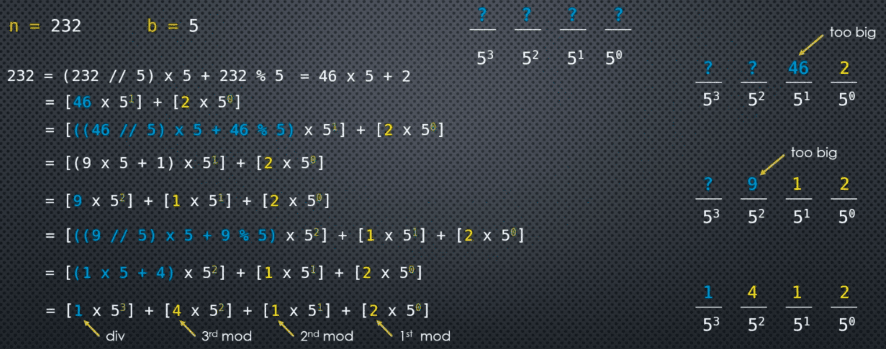
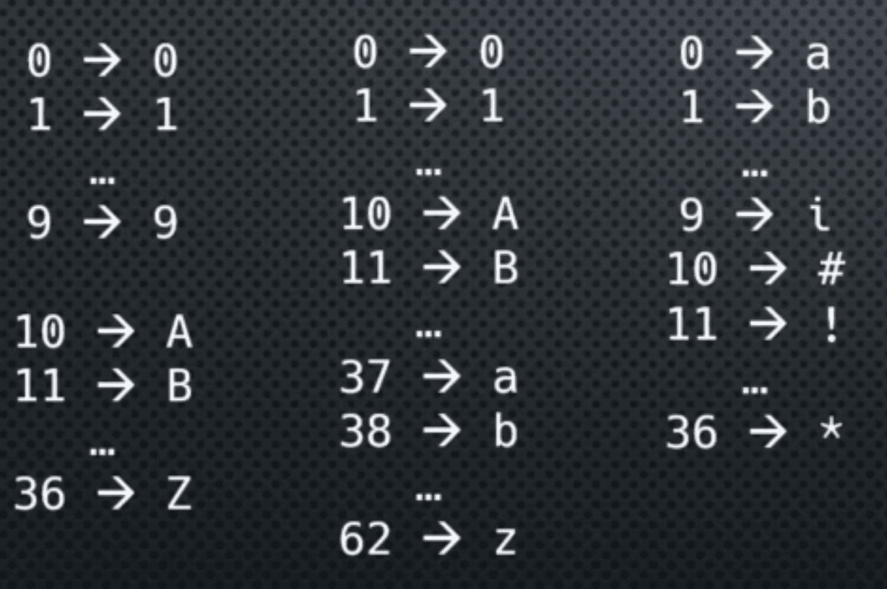

An integer number is an object - an instance of the **int** class. The **int** class provides multiple constructors.

a = int(10)
a = int(-10)

Other (numerical) data types are also supported in the argument of the **int** constructor:

a = int(10.9)    ->  **truncation**: a = 10
a = int(-10.9)   ->  **truncation**: a = -10
a = int(True)    a = 1 
a = int(Decimal("10.9"))    -> **truncation**: a = 10 

As well as **strings** (that can be parsed to a number)
a = int("10")

___
### Number Base

int("123") -> (123)$_1$$_0$

When used with a string, the constructor has an **optional second** parameter: ```base```   **2 <= base <= 36**

If the base is not specified, the default is base 10 - as in the example above

```int("1010", 2)``` 		-> (10)$_1$$_0$    	```int("1010", base=2)```

```int("A12F", base=16)``` 	-> (41263)$_1$$_0$   	```int("a12f", base=16)```

```int("534", base=8)``` 	-> (348)$_1$$_0$

```int("A", base=11)``` 	-> (10)$_1$$_0$

```int("B", 11)``` -> **ValueError**: invalid literal for int() with base 11: 'B'

**Reverse Process: changing an integer from base 10 to another base**

built-in functions: **bin()** ```bin(10)``` -> '**0b**1010'
                    **oct()** ```oct(10)``` -> '**0o**12'
                    **hex()** ```hex(10)``` -> '**0x**a'

The prefixes in the strings help document the base of the number ```int('0xA', 16)``` -> (10)$_1$$_0$

These prefixes are consistent with literal integers using a base prefix (no strings attached!)

```a = 0b1010``` a -> 10 
```a = 0o12```   a -> 10 
```a = 0xA```    a -> 10

**What about other bases?**

For that, you need some **custom code**

```n```: number (base 10)
```b```: base (target base)



___
### Base Change Algorithm

n = base-10 number (>= 0)
b = base (>= 2)

if b < 2 or n < 0: **raise exception**
if n == 0: **return** [0]

digits = [ ]
while n > 0:
    m = n  % b 
    n = n // b
    digits.insert(0, m)

This algorithm returns a list of the digits in the specified base b (a representation of n$_1$$_0$ in base b) usually we want to return an encoded number where digits higher than 9 use letters such as A-Z. We simply need to decide what character to use for the various digits in the base.

___
### Encodings

Typically, we use 0-9 and A-Z for digits required in bases higher than 10, but we don't have to use letters or even standard 0-9 digits to encode our number. We just need to map between the digits in our number, to a character of our choice.



**Python uses 0-9 and a-z (case insensitive) and is therefore limited to base <= 36**

Your choice of characters to represent the digits is your **encoding map**

The simplest way to do this given a list of digits to encode, is to create a string with as many characters as needed and use their index (ordinal position) for our encoding map 

base b (>=2)
map = ' ... ' (of length b)
digits = [ ... ]
encoding = map[digits[0]] + map[digits[1]] + ...

**Example: Base 12**

map = '0123456789ABC'
digits = [4, 11, 3, 12]
encoding = '4B3C'

digits [ ... ]
map = ' ... '

encoding = ''
for d in digits:
    encoding += map[d]  ``` ( a += b -> a = a + b) ```

or, more simply:
encoding = ''.join([map[d] for d in digits])

___
### Code Example

```python 
import fractions

a = fractions.Fraction(22, 7)
print(a)
print(float(a))
print(int(a))
```

```python
print(int("101", 2))
print(int("FF", 16))
```

```python
print(bin(10))
print(oct(10))
print(hex(255))
```

```python
a = int('101', 2)
b = 0b101 

print(a)
print(b)
```

```python
def from_base10(n, b):
    if b < 2:
        raise ValueError('Base b must be >= 2')

    if n < 0:
        raise ValueError("Number n must be >= 0")

    if n == 0:
        return [0]

    digits = []
    while n > 0:
        n, m = divmod(n, b) # Divmod function doing the module and divide
        digits.insert(0, m)
    
    return digits

print(from_base10(10, 2))
print(from_base10(255, 16))
```

```python
def encode(digits, digit_map):
    if max(digits) >= len(digit_map):
        raise ValueError("digit_map is not long enough to encode the digits")

    # encoding = ''
    # for d in digits:
    #    encoding += digit_map[d]
    # return encoding

    return ''.join([digit_map[d] for d in digits])

print(encode([15, 15], '0123456789ABCDEF'))
```

```python
def rebase_from10(number, base):
    digit_map = '0123456789ABCDEFGHIJKLMNOPQRSTUVWXYZ'

    if 2 < base > 36:
        raise ValueError('invalid base: 2 <= base <= 36')

    sign = -1 if number < 0 else 1 
    number *= sign 

    digits = from_base10(number, base)
    encoding = encode(digits, digit_map)
    
    if sign == -1:
        encoding = '-' + encoding
    return encoding

e = rebase_from10(314, 2)
print(e)
print(int(e, base=2))

e = rebase_from10(3451, 16)
print(e)
print(int(e, base=16))

e = rebase_from10(-314, 2)
print(e)
print(int(e, base=16))
```

___

