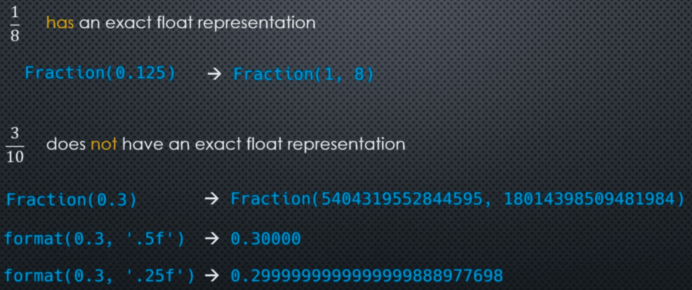

**Rational** numbers are **fractions** of integer numbers ex: 
$$-\frac{22}{7}$$
Any real number with a **finite** number of digits after the decimal point is **also** a rational number.
$$0.45=\frac{45}{100}$$
$$0.123456789=\frac{123456789}{10^9}$$
Similarly,
$$\frac{8.3}{4}=\frac{\frac{83}{10}}{4}=\frac{83}{10}\cdot\frac14=\frac{83}{40}$$
as, 
$$\frac{8.3}{1.4}=\frac{\frac{83}{10}}{\frac{14}{10}}=\frac{83}{10}\cdot\frac{14}{10}=\frac{83}{14}$$
___
### The Fraction Class

Rational numbers can be represented in Python using the **Fraction** class in the **fractions** module

```python 
from fractions import Fraction

x = Fraction(3, 4)
y = Fraction(22, 7)
z = Fraction(6, 10)

print(y)
```

Here, Fraction automatically **reduced**: ```Fraction(6, 10) -> Fraction(3, 5)```

Negative sign, if any, is always attached to the numerator: 
```Fraction(1, -4) -> Fraction(-1, 4)```

___
### Constructors

- Fraction(numerator=0, denominator=1)
- Fraction(other_fraction)
- Fraction(float)
- Fraction(decimal)
- Fraction(string)
    - Fraction('10')    -> Fraction(10, 1)
    - Fraction('0.125') -> Fraction(1, 8)
    - Fraction('22/7')  -> Fraction(22, 7)

Standard arithmetic operators are supported: ```+, -, *, /``` and result in **Fraction** objects as well
$$\frac23\cdot\frac12=\frac26=\frac13$$
```Fraction(2, 3) * Fraction(1, 2)  ->  Fraction(1, 3)```

Getting the **numerator** and **denominator** of **Fraction** objects:

```python
x = Fraction(22, 7)

print(x.numerator)
print(x.denominator)
```

**float** objects have **finite** precision -> **any** ```float``` object can be written as a fraction!

```python
print(Fraction(0.75))
print(Fraction(1.375))
```

```python
import math

x = Fraction(math.pi)
print(x)

y = Fraction(math.sqrt(2))
print(y)
```

Since they're finite precision real numbers they are expressible as rational numbers, **but it is an approximation**

___
### Word of Warning 

**Converting a** ```float``` **to a** ```Fraction``` **has an important caveat**



___
### Constraining the Denominator

Given a ```Fraction``` object, we can find an **approximate** equivalent fraction with a **contained denominator**
    using the ```limit_denominator(max_denominator=1_000_000)``` instance method
i.e. finds the closets rational (which could be precisely equal)
    with a denominator that does not exceed ```max_denominator```

```python
x = Fraction(math.pi)
print(x)
x = x.limit_denominator(10)
print(x)
```

___
### Code Example

```python
from fractions import Fraction 
import math 

x = Fraction(math.pi)
print(float(x))

y = Fraction(math.sqrt(2))
print(y)
print(float(y))

a = 0.125
print(a)

b = 0.3 
print(b)

print(Fraction(a))
print(Fraction(b))

print(format(b, '0.5f'))
print(format(b, '0.15f'))
print(format(b, '0.25f'))

print(x.limit_denominator(10))
print(x.limit_denominator(100))
```

___

