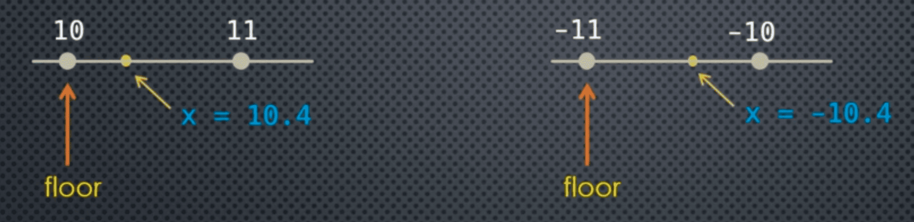

**Float** -> **Integer** | data loss 

There are different ways to configure this data loss, i.e. 
10.4 -> 10? or 11? Similarly, 10.5 -> 10? or 11?

For all that we have these methods:
- truncation
- floor
- ceiling
- rounding

It's pick your poison because in all cases we'll have data loss

___
### Truncation 

truncating a float simply returns the **integer portion** of the number i.e. ignores everything after the decimal point.

The **math** module provides us with the **trunc()** function:

```python
import math 

print(math.trunc(10.4))
print(math.trunc(10.5))
print(math.trunc(10.6))

print(math.trunc(-10.4))
print(math.trunc(-10.5))
print(math.trunc(-10.6))
```
#### The **int** Constructor

The Python **int** constructor will accept a **float** uses **truncation** when casting the **float** to an **int**.

```python
print(int(10.4))
print(int(10.5))
print(int(10.6))

print(int(-10.4))
print(int(-10.5))
print(int(-10.6))
```

___
### Floor 

The **floor** of a number is the **largest** integer **less** than (or equal to) the number **floor(x) = max {i E Z | i <= x}**



For **positive** numbers, floor and truncation are equivalent but **not** for **negative** numbers! Recall also our discussion on integer division - aka floor division: **//**

But in fact, floor division defined that way yields the same result as taking the floor of the floating point division **a // b == floor (a / b)** 

```python
import math 

print(math.floor(10.4))
print(math.floor(10.5))
print(math.floor(10.6))

print(math.floor(-10.4))
print(math.floor(-10.5))
print(math.floor(-10.6))
```

___
### Ceiling 

The **ceiling** of a number is the **smallest** integer **greater** than (or equal to) the number **ceil(x) = min {i E Z | i >= x}**

```python
import math 

print(math.ceil(10.4))
print(math.ceil(10.5))
print(math.ceil(10.6))

print(math.ceil(-10.4))
print(math.ceil(-10.5))
print(math.ceil(-10.6))
```

___
### Code Example

```python
from math import trunc

help(trunc)

print(trunc(10.3), trunc(10.5), trunc(10.9)) 
print(int(10.3), int(10.5), int(10.9)) 
```

```python
from math import floor 

help(floor)

print(floor(10.3), floor(10.5), floor(10.9))
print(floor(-10.4), floor(-10.5), floor(-10.9))
```

```python
from math import ceil

help(ceil)

print(ceil(10.3), ceil(10.5), ceil(10.9))
print(ceil(-10.4), ceil(-10.5), ceil(-10.9))
```

___

