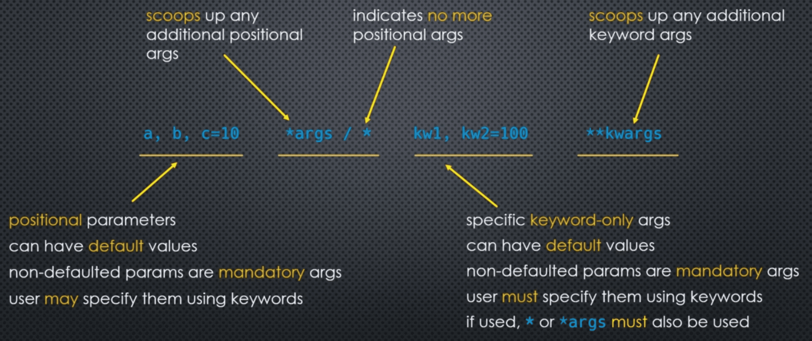
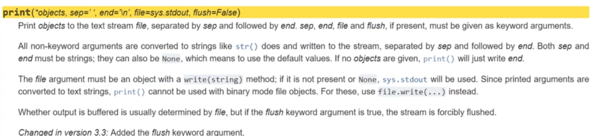

### Recap

- **Positional** arguments 
    - specific  -> may have default values 
    - *args     -> collects, and exhausts remaining positional arguments 
    - ```*```   -> indicates the end of positional arguments (effectively exhausts)

- **keyword-only** arguments 
    - after positional arguments have been exhausted
    - specific - may have default values 
    - ```**kwargs``` - collects any remaining keyword arguments


#### Examples

```python
def func(a, b=10):
    pass

def func(a, b, *args):
    pass 

def func(a, b, *args, kw1, kw2=100):
    pass

def func(a, b=10, *, kw1, kw2=100):
    pass

def func(a, b, *args, kw1, kw2=100, **kwargs):
    pass
    
def func(a, b=10, *, kw1, kw2=100, **kwargs):
    pass

def func(*args):
    pass 

def func(**kwargs):
    pass 

def func(*args, **kwags):
    pass
```

___
### Typical Use Case: Python's ```print()``` function



```*objects```  -> arbitrary number of positional arguments 
after that are keyword-only arguments
they all have default values, so they are all optional

Often, keyword-only arguments are used to modify the default behavior of a function. Such as the ```print()``` function. 

```python
def calc_hi_lo_avg(*args, log_to_console=False):
    hi = int(bool(args)) and max(args)
    lo = int(bool(args)) and min(args)
    avg = (hi + lo)/2 
    if log_to_console:
        print("high={0}, low={1}, avg={2}".format(hi, lo, avg))
    return avg
```

Other times, keyword-only arguments might be used to make things clearer.

Having many positional parameters can become confusing, and extra care has to be taken to ensure the correct parameters are passed in the correct sequence.

___
### Code Example 

```python
def func(a, b, *args):
    print(a)
    print(b)
    print(args)

func(1, 2, 'x', 'y', 'z')
```

```markdown
func(a=1, b=2, 'x', 'y', 'z')
```

The following code will give us **SyntaxError** ```positional arguments follows keyword argument```

```python
def func(a, b=2, *args, c=3, d):
    print(a, b, args, c, d)

func(10, 20, 'x', 'y', 'z', c=4, d=1)
func(10, 20, 'x', 'y','z', d=10)
```

```python
help(print)
```

___

