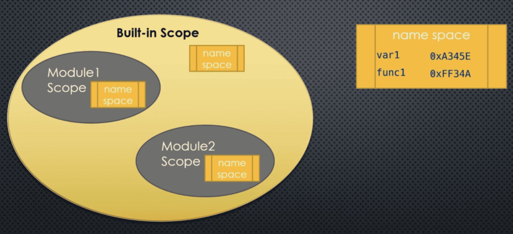
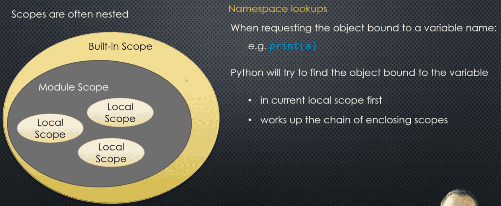
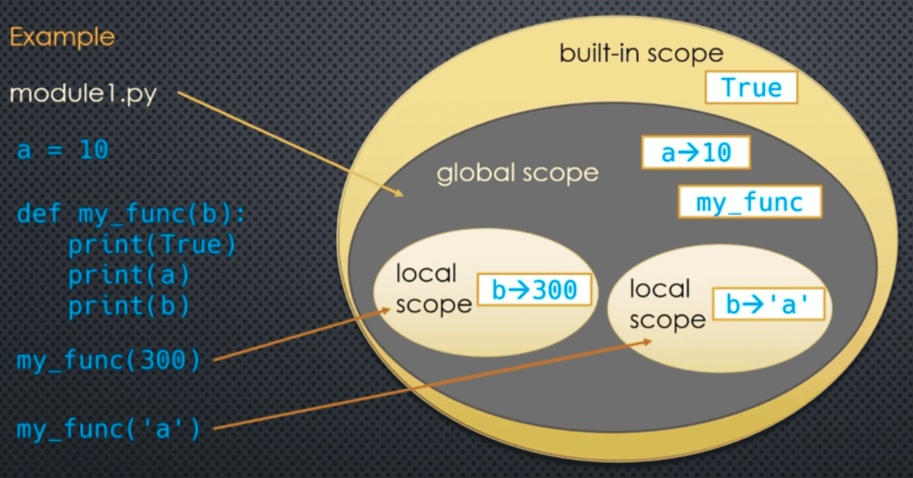
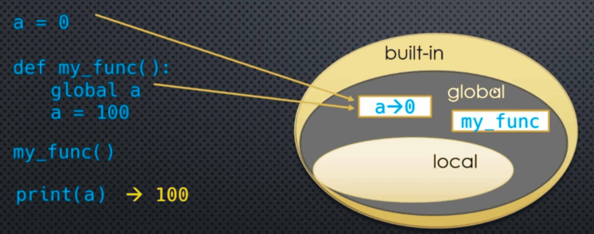

### Scopes and Namespaces 

When an object is assigned to a variable ```a = 10``` that variable points to some object and we say that the variable (name) is **bound** to that object. 

That object can be accessed using that name in various parts of our code **But not just anywhere!** 

That variable name and its binding (name and object) only "exist" in specific parts of our code, the portion of code where that name/binding is defined, is called the **lexical scope** of the variable these bindings are stored in **namespaces** (each scope has its own namespace)

___
### The Global Scope

The **global** scope is essentially the **module** scope. It spans a **single** file only. There is no concept of a truly global (across all the modules in our entire app) scope in Python. The only exception to this are some of the **built-in** globally available objects, such as ```True```, ```False```, ```None```, ```dict```, ```print```

The built-in and global variables can be used **anywhere** inside our module. Including inside any **function** 
#### Global scopes are nested inside the built-in scope



If you reference a variable name inside a scope and Python **does not find it** in that scope's namespace it will look for it in an **enclosing** scope's namespace
#### Examples

module1.py ```print (True)``` -> Python does not find ```True``` or ```print``` in the current (module/global) scope. So, it looks for them in the enclosing scope **built-in** Finds them there -> ```True```

module2.py ```print(a)``` -> Python does not find ```a``` or ```print``` in the current (module/global) scope. So, it looks for them in the enclosing scope **built-in**. Find ```print```, but not ```a``` -> ```run-time Name Error```

module3.py ```print = lambda x: 'hello {0}!'.format(x)``` ```s = print('world)``` -> Python fins ```print``` in the **module** scope **So it uses it!** ```s -> hello world``` This is also called **masking**, but usually, it's not a good idea to do that. Because if you're using ```print``` function to re-defining into something else then how do you tell Python I don't want the **local** one but the **global** one.

___
### The Local Scope

When we create functions, we can create variable names inside those functions (using assignments) e.g. ```a = 10```.

Variables defined inside a function are not created until the function is **called**. Every time the function is called, a **new scope is created**. Variables defined inside the function are assigned to that scope.

- **Function Local** scope 
- **Local** scope 

The actual object the variable references could be **different** each time the function is called (this is why recursion works!)
#### Example 

```python 
def my_func(a, b):
    c = a * b 
    return c 
```

Here, ```my_func``` -> ```a```, ```b```, and ```c``` these names will considered **local** to ```my_func```

```python
my_func('z', 2) # -> a = 'z', b = 2, and c = 'zz'
```

```python
my_func(10, 5) # -> a = 10, b = 5, and c = 50
```

Here, ```a```, ```b```, and ```c``` are the same names but are in different scopes

___
### Nested Scopes 





Remember reference counting?

When ```my_func(var)``` finishes running, the scope is gone too! And the reference count of the object ```var``` was bound to (referenced) is decremented. We also say that ```var``` **goes out of scope**

___
### Accessing the Global Scope from a Local Scope 

When **retrieving** the value of a global variable from inside a function, Python automatically searches the local scope's namespace, and up the chain of all enclosing scope namespaces.

**local** -> **global** -> **built-in**

What about modifying a global variables value from inside the function?

```python
a = 0 

def my_func():
    a = 100     # assignment -> Python interprets this as a 'local' variable (at compile-time), the local variable `a` masks the global variable `a`
    print(a)
```

___
### The `global` Keyword

We can tell Python that a variable is meant to be scoped in the global scope by using the `global` keyword



___
### Global and Local Scoping 

When Python encounters a function definition at **compile-time** it will **scan** for any labels (variables) that have values **assigned** to them (**anywhere** in the function). If the label has not been specified ```global```, then it will be **local**. 

Variables that are referenced but **not assigned** a value **anywhere** in the function will **not be local**, and Python will, at **run-time**, look for them in **enclosing** scopes.

```python
a = 10 

def func1():
    print(a) # a is referenced only in the entire function at compile-time -> a non-local

def func2():
    print = 100 # assignment at compile-time -> a local 


def func3():
    global a 
    a = 100 # assignment at compile-time -> a global (because we told Python a was global)

def func4():
    print(a)
    a = 100  # assignment at compile-time -> a local
```

Here, if we call ```func4()``` the ```print(a)``` results in a **run-time error**. Because ```a``` is local, and we are referencing it **before** we have assigned a value to it!

___
### Code Example 

```python
a = 10 
```

```python
def my_func(n):
    c = n ** 2 
    return c 
```

```python
def my_func(n):
    print('global a:', a)
    c = a ** n 
    return c
```

```python
my_func(2)
```

```python
def my_func(n):
    a = 20 
    c = a ** n 
    return c

print(a)
print(my_func(2))
print(a)
```

```python
def my_func(n):
    global a 
    a = 20 
    c = a ** n 
    return c

print(a)
print(my_func(2))
print(a)
```

```python
def my_func():
    global var 
    var = 'hello world'
    return 

# print(var) This will give us error, we need to run the function first
my_func()
print(var)
```

```python
a = 10 

def my_func():
    global a 
    a = 'hello'
    print('global a:', a)

my_func()
```

```python
print(a)

a = 10 

def my_func():
    print('global a:', a)
    a = 'hello world'
    print(a)

# my_func() This will give us local variable 'a' used before assigned 
```

```python
f = lambda n: print(a ** n)

f(2)
```

```python
print(True)
```

```python
def print(x):
    return 'hello {0}'.format(x)

# print('world', '!') This will give us error because we've modified the print function, so be careful while using the built-in names
```

```python
del print 

print('world', '!')
```

```markdown
// Example in Java 

for (int i = 0; i < 10; i++){
    int x = 2 * i;
}

system.out.println(x); // This will give us error
```

```python
for i in range(10):
    x = 2 * i

print(x)

# It's not quite the same in Python compare to other language
```

___

