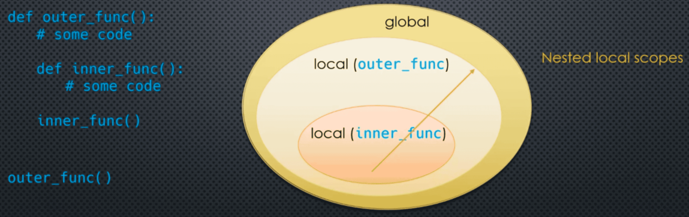
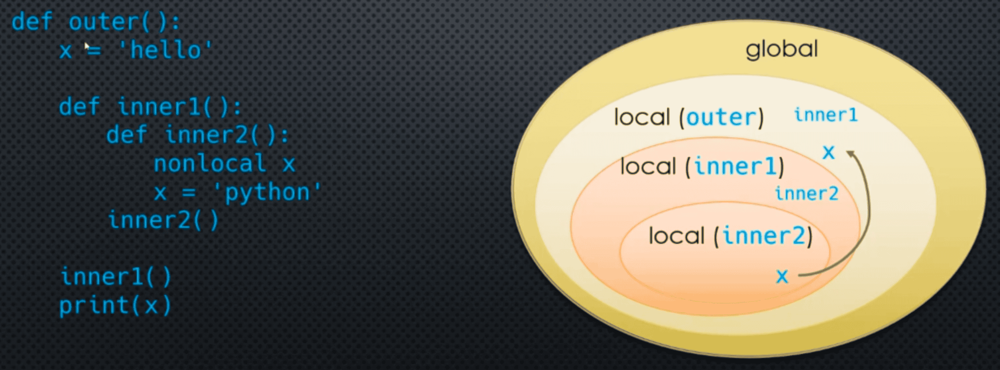
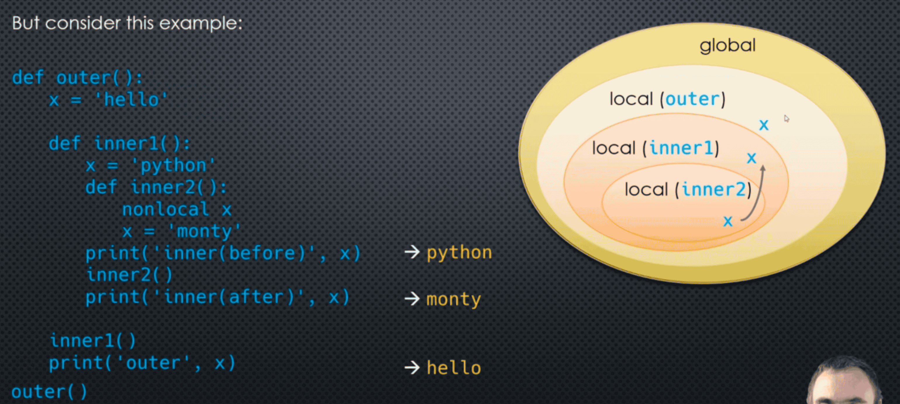
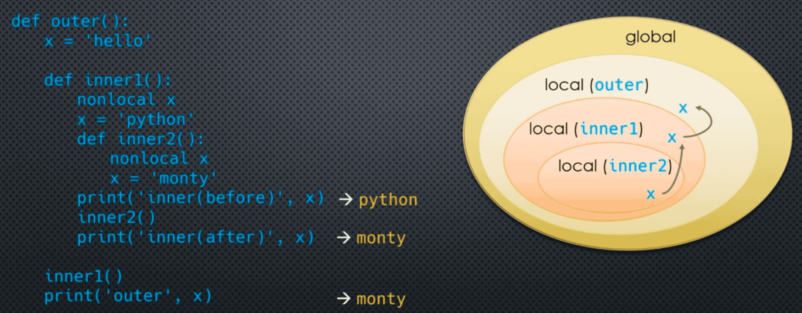
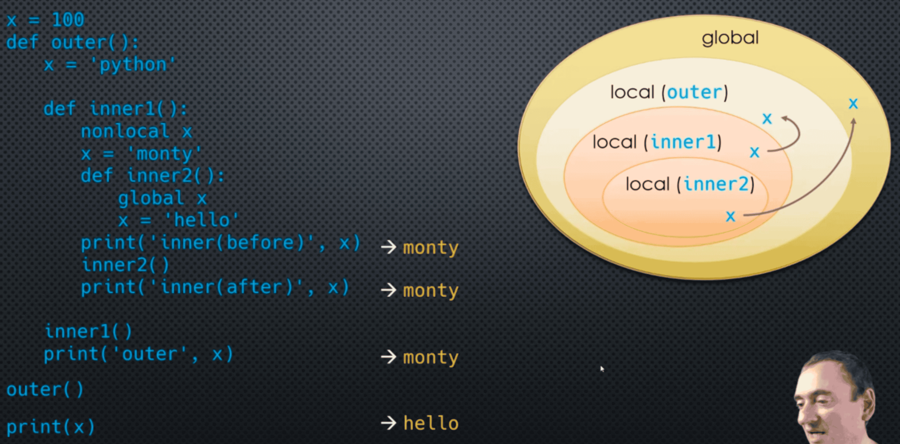

### Inner Functions

We can define functions from inside another function:



Both functions have access to the global and built-in scopes as well as their respective local scopes. But the **inner** function also has access to its **enclosing** scope - the scope of the **outer** function. That scope is neither local (to ```inner_func```) nor global - it is called a **nonlocal** scope

___
### Referencing Variables from the Enclosing Scope 

Consider this example we have seen before:

```python
# Module1.py 

a = 10 

def outer_func():
    print(a)

outer_func()
```

When we call ```outer_func```, Python sees the reference to ```a```. Since ```a``` is not in the local scope, Python looks in the **enclosing** (global) scope

Now, Consider this example: 

```python
# Module1.py 

def outer_func():
    a = 10 

    def inner_func():
        print(a)

    inner_func()
    
outer_func()
```

When we call ```outer_func```, ```inner_func``` is created and called. When ```inner_func``` is called, Python does not find ```a``` in the local (```inner_func```) scope. So it looks for it in the **enclosing** scope, in this case, the scope of ```outer_func```

```python
# Module1.py 

a = 10 

def outer_func():

    def inner_func():
        print(a)

    inner_func() 

outer_func()
```

When we call ```outer_func```, ```inner_func``` is defined and called. When ```inner_func``` is called, Python does not find ```a``` in the local (```inner_func```) scope. So it looks for it in the **enclosing** scope, in this case the scope of ```outer_func```. Since it does not find it there either, it looks in the **enclosing (global)** scope

___
### Modifying Global Variables 

We saw how to use the ```global``` keyword in order to modify a global variable within a nested scope.

```python
a = 10 

def outer_func1():
    global a 
    a = 1000 

outer_func1()
print(a)  # 1000 We cann of course do the same thing from within a nested function 

def outer_func2():
    def inner_func():
        global a 
        a = 'hello'
    inner_func()

outer_func2()
print(a)
```

___
### Modifying NonLocal Variables

Can we modify variables defined in the outer nonlocal scope?

```python
def outer_func():
    x = 'hello'

    def inner_func():
        x = 'python' # This x here masks the outer_func variable x

    inner_func()
    print(x)

outer_func() # hello
```

When ```inner_func``` is compiled, Python sees an ```assignment``` to ```x```, so it determines that ```x``` is a **local** variable to ```inner_func```. The variable ```x``` in ```inner_func``` **masks** the variable ```x``` in ```outer_func```.

Just as with global variables, we have to **explicitly** tell Python we are modifying a nonlocal variable. We can do that using the ```nonlocal``` keyword 

```python
def outer_func():
    x = 'hello'

    def inner_func():
        nonlocal x 
        x = 'python'

    inner_func()
    print(x)

outer_func() # python
```

___
### NonLocal Variables

Whenever Python is told that a variable is **nonlocal**. It will look for it in the **enclosing local scopes** chain until it **first** encounters the specified variable name.

**Beware**: It will only take local scopes, it will **not** look at the **global** scope

```python
def outer():
    x = 'hello'

    def inner1():
        def inner2():
            nonlocal x 
            x = 'python'
        inner2()

    inner1()
    print(x)

outer()
```



But consider this example:

```python
def outer():
    x = 'hello'

    def inner1():
        x = 'python'
        def inner2():
            nonlocal x 
            x = 'monty'
        print('inner(before)', x) # python
        inner2()
        print('inner(after)', x) # monty

    inner1()
    print('outer', x) # hello

outer()
```



```python
def outer():
    x = 'hello'

    def inner1():
        nonlocal x 
        x = 'python'
        def inner2():
            nonlocal x 
            x = 'monty'
        print('inner(before)', x)
        inner2()
        print('inner(after)', x)

    inner1()
    print('outer', x)
outer()
```



___
### NonLocal and Global Variables

```python
x = 100 
def outer():
    x = 'python'

    def inner1():
        nonlocal x 
        x = 'monty'
        def inner2():
            global x 
            x = 'hello'
        print('inner(before)', x)
        inner2()
        print('inner(after)', x)

    inner1()
    print('outer', x)
outer()
print(x)
```



___
### Code Example 

```python
def outer_func():
    x = 'hello'
    def inner_func():
        print(x)
    inner_func()

outer_func()
```

```python
def outer_func():
    x = 'hello'
    def inner1():
        def inner2():
            print(x)
        inner2()
    inner1()

outer_func()
```

```python
def outer_func():
    x = 'hello'
    def inner():
        x = 'python'
        print('inner:', x)
    inner()
    print('outer:', x)
outer_func()
```

```python
def outer_func():
    x = 'hello'
    def inner():
        nonlocal x 
        x = 'python'
        print('inner:', x)
    print('outer(before)', x)
    inner()
    print('outer(after):', x)
outer_func()
```

```python
def outer():
    x = 'hello'
    def inner1():
        def inner2():
            nonlocal x
            x = 'python'
        inner2()
    inner1()
    print(x)

outer()
```

```python
def outer():
    x = 'hello'
    def inner1():
        nonlocal x 
        x = 'python'
        def inner2():
            nonlocal x
            x = 'monty'
        inner2()
    inner1()
    print(x)

outer()
```

```python
x = 'python'

def outer():
    x = 'monty'

    def inner():
        nonlocal x 
        x = 'hello'
    print(x)

outer()
print(x)
```

___

