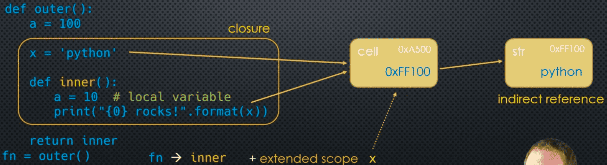

### Free Variables and Closures

Remember: Functions defined inside another function can access the outer (nonlocal) variables

```python
def outer():
    x = 'python'

    def inner():
        print("{0} rocks!".format(x))

    inner()

outer()
```

Here, this ```x``` refers to the one in ```outer```'s scope this nonlocal variable ```x``` is called a ```free``` variable 

When we consider ```inner```, we really are looking at:

- The function ```inner```
- The free variable ```x``` (with current value ```python```)

___
### Returning the `inner` Function

What happens if, instead of calling (running) ```inner``` from inside ```outer``, we **return** it? 

```python
def outer():
    x = 'python'

    def inner():
        print("{0} rocks!".format(x))

    return inner 

fn = outer()
```

Here, ```x``` is a free variable in ```inner``` it is ```bound``` to the variable ```x``` in ```outer``` this happens when ```outer``` runs (i.e. when ```inner``` is created) this is the ```closure```

When we return ```inner```, we are actually "returning" the **closure** 

We can assign that return value to a variable name: ```fn = outer()```

```python
fn()
```

When we **called** ```fn``` **at that time** Python determined the value of ```x``` in the extended scope. But notice that ```outer``` had finished running ```before``` we called ```fn``` it's scope was "gone"

___
### Python Cells and Multi-Scoped Variables

```python
def outer():
    x = 'python'
    def inner():
        print(x)
    return inner 
```

Here, the value of ```x``` is **shared** between two scopes: 

- outer
- closure

The label x is **in two different scopes**. Python does this by creating a **cell** as an intermediary object


In effect, both variables ```x``` (in ```outer``` and ```inner```), point to the ```same``` cell. When requesting the value of the variable, Python will "double-hop" to get to the final value.

 ___
### Closures Topic 

You can think of the closure as a function **plus** an extended scope that contains the **free variables**. The free variable's value is the object the cell points to - so that could change over time! Every time the function in the closure is called and the free variable is referenced: Python looks up the **cell** object, and then whatever the cell is **pointing** to look up the value 

```python
def outer():
    a = 100 

    x = 'python'

    def inner():
        a = 10 # local variable
        print("{0} rocks!".format(x))

    return inner
```



___
### Introspection

```python
def outer():
    a = 100 
    x = 'python'
    def inner():
        a = 10 # local variable
        print("{0} rocks!".format(x))
    return inner 

fn = outer()
print(fn.__code__.co_freevars)
print(fn.__closure__)
```

```python
def outer():
    x = 'python'
    print(hex(id(x)))
    def inner():
        print(hex(id(x)))
        print("{0} rocks!".format(x))
    return inner 

fn = outer()
fn()
```

___
### Modifying Free Variables

```python
def counter():
    count = 0 

    def inc():
        nonlocal count 
        count += 1 
        return count 
    
    return inc

fn = counter()
print(fn())
print(fn())
```

Here, **count** is a free variable, it is **bound** to the **cell** ```count``` and ```fn``` -> **inc + count -> 0**

___
### Multiple Instances of Closures 

Every time we run a functionm a **new** scope is created. If that function generates a closure, a **new** closure is created every time as well

```python
def counter():
    count = 0 

    def inc():
        nonlocal count 
        count += 1 
        return count 

    return inc 

f1 = counter()
f2 = counter()

print(fn1())
print(fn1())
print(fn1())

print(fn2())
print(fn2())
```

```f1``` and ```f2``` do not have the same extended scope. They are different **instances** of the closure, the **cells** are **different**

___
### Shared Extended Scopes 

```python
def outer():
    count = 0

    def inc1():
        nonlocal count 
        count += 1 
        return count 

    def inc2():
        nonlocal count 
        count += 1 
        return count 

    return inc1, inc2

f1, f2 = outer()

print(fn1())
print(fn2())
```

Here, ```count``` is a free variable - bound to ```count``` in the extended scope, in ```inc2()``` the ```count``` is a free variable - bound to the **same** ```count```, whereas the ```return``` statement returns a tuple containing both closures

You may think this shared extended scope is highly unusual... but it's not! 

```python
def adder(n):
    def inner(x):
        return x + n

    return inner

add_1 = adder(1)
add_2 = adder(2) # Three different closures - no shared scopes
add_3 = adder(3)

print(add_1(10)) # 11 
print(add_2(10)) # 12 
print(add_3(10)) # 13
```

But suppose we tried doing it this way:

```python
adders = []
for n in range(1, 4):
    adders.append(lambda x: x + n)
```

- n = 1: The free variable in the lambda is ```n```, and it is bound to the ```n``` we created in the loop
- n = 2: The free variable in the lambda is ```n```, and it is bound to the (**same**) ```n``` we created in the loop
- n = 3: The free variable in the lambda is ```n```, and it is bound to the (**same**) ```n``` we created in the loop

```python
print(adders[0](10))
print(adders[1](10))
print(adders[2](10))
```

Remember, Python does not "evaluate" the free variable ```n``` until the ```address[i]``` function. Since all three functions in ```address``` are bound to the **same** ```n``` by the time we call ```address[0]```, the value of ```n``` is ```3``` (the last iteration of the loop set ```n``` to ```3```)

___
### Nested Closures

```python
def incrementer(n):
    # inner + n is a closure 
    def inner(start):
        current = start 
        # inc + current + n is a closure
        def inc():
            nonlocal current 
            current += n 
            return current

        return inc 
    return inner

# (inner)
fn = incrementer(2)
print(fn.__code__.co_freevars)

inc_2 = fn(100)
print(inc_2.__code__.co_freevars)

# (call inc)
print(inc_2())
print(inc_2())
```

___
### Code Example 

```python
def outer():
    x = 'python'
    def inner():
        print(x)
    return inner 

fn = outer()
print(fn.__code__.co_freevars)
print(fn.__closure__)
```

```python
def outer():
    x = [1, 2, 3]
    print(hex(id(x)))

    def inner():
        y = x
        print(hex(id(y)))

    return inner

fn = outer()
print(fn)
print(fn())
```

```python
def outer():
    count = 0 
    def inc():
        nonlocal count 
        count += 1 
        return count 
    return inc

fn = outer()
print(fn.__code__.co_freevars)
print(fn.__closure__)
print(hex(id(0)))

print(fn())
```

```python
def outer():
    count = 0 

    def inc1():
        nonlocal count 
        count += 1 
        return count 

    def inc2():
        nonlocal count 
        count += 1 
        return count 

    return inc1, inc2

fn1, fn2 = outer()

print(fn1.__code__.co_freevars, fn2.__code__.co_freevars)
print(fn1.__closure__, fn2.__closure__)

print(fn1())
print(fn1.__closure__, fn2.__closure__)

print(fn2())
```

```python
def pow(n):
    def inner(x):
        return x ** n
    return inner

square = pow(2)

print(square.__closure__)
print(hex(id(2)))

print(square)
print(square(5))

cube = pow(3)
print(cube.__closure__)
print(hex(id(3)))

print(cube(5))
```

```python
def adder(n):
    def inner(x):
        return x + n 
    return inner

add_1 = adder(1)
add_2 = adder(2)
add_3 = adder(3)

print(add_1.__closure__, add_2.__closure__, add_3.__closure__)

print(add_1(10))
print(add_2(10))
print(add_3(10))
```

```python
adders = []

for n in range(1, 4):
    adders.append(lambda x: x + n)

print(adders[0].__closure__)
print(adders[0](10))
```

```python
def create_adders():
    adders = []
    for n in range(1, 4):
        adders.append(lambda x: x + n)
    return adders

adders = create_adders()
print(adders)
print(adders[0].__closure__)
print(adders[1].__closure__)

print(adders[0](10))
```

```python
def create_adders():
    adders = []
    for n in range(1, 4):
        adders.append(lambda x, y=n: x + y)
    return adders

adders = create_adders()

print(adders)

print(adders[0].__closure__)
print(adders[0].__code__.co_freevars)

print(adders[0](10, 5))
```

___

