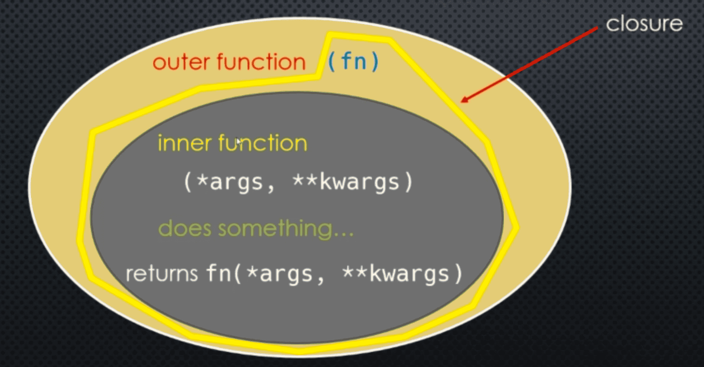

Let's recall the simple closure example we did which allowed us to maintain a count of how many times a function was called:

```python
def counter(fn):
    count = 0 
    def inner(*args, **kwargs):
        nonlocal count 
        count += 1 
        print('Function {0} was called {1} times'.format(fn.__name__, count))
        return fn(*args, **kwargs)
    return inner
```

Here, using ```*args``` and ```**kwargs``` means we can call any function ```fn``` with any combination of positional and keyword-only arguments

```python
def add(a, b=0):
    return a + b

add = counter(add)
result = add(1, 2)

print(add)
print(result)
```

We modified our ```add``` function by wrapping it inside another function that added some functionality to it. We also say that we **decorated** our function ```add``` with the function ```counter```. And we call ```counter``` a **decorator** function

In general a **decorator** functions:

- Takes a function as an argument 
- Returns a closure 
- The closure usually accepts any combination of parameters
- Runs some code in the inner function (closure)
- The closure function calls the original function using the arguments passed to the closure 
- Returns whatever is returned by that function call



___ 
### Decorators and the ```@``` Symbol 

In our previous example, we saw that ```counter``` was a **decorator** and we could **decorate** our ```add``` function using: ```add = counter(add)```

In general, if ```func``` is a decorator function, we **decorate** another function ```my_func``` using: This is so common that Python provides a convenient way of writing that:

```python
@counter 
def add(a, b):
    return a + b 
```

Is the same as writing 

```python
def add(a, b):
    return a + b 

add = counter(add)
```

```markdown
@func 
def my_func(...):
    ...
```

Is the same as writing

```markdown
def my_func(f):
    pass

my_func = func(my_func)
```

___ 
### Introspecting Decorated Functions 

Let's use the same ```count``` decorator. 

```python
def counter(fn):
    count = 0 
    def inner(*args, **kwargs):
        nonlocal count 
        count += 1 
        print("{0} was called {1} times".format(fn.__name__))
        return fn(*args, **kwargs)
    return inner
```

```python
@counter 
def mult(a, b, c=1):
    """
        returns the product of three values
    """
    return a * b * c
```

Remember we could equally have written: ```mult = counter(mult)```

```python
mult.__name__
```

As we can see the **mult**'s name "changed" when we decorated it they are not the same function after all

```python
help(mult)
```

We have also "lost" our docstring, and even the original function signature. Even using the ```inspect``` module's ```signature``` does not yield better results

___
### One Approach to Fixing This 

We could try to fix this problem, at least for the docstring and function name as follows:

```python
def counter(fn):
    count = 0
    def inner(*args, **kwargs):
        nonlocal count 
        count += 1 
        print('Function {0} was called {1} times'.format(fn.__name__, count))
        return fn(*args, **kwargs)
    inner.__name__ = fn.__name__
    inner.__doc__ = fn.__doc__
    return inner
```

But this doesn't fix losing the function signature - doing so would be quite complicated. Instead, Python provides us with a special function that we can use to fix this 

___
### The ```functools.wraps``` Function 

The ```functools``` module has a ```wraps``` function that we can use to fix the metadata of our ```inner``` function in our decorator 

```from functools import wraps```

In fact, the ```wraps``` function is itself a decorator, but it needs to know what was our "original" function - in this case ```fn```

```python
def counter(fn):
    count = 0 
    def inner(*args, **kwargs):
        nonlocal count 
        count += 1 
        print(count)
        return fn(*args, **kwargs)
    inner = wraps(fn)(inner)
    return inner
```

```python
def counter(fn):
    count = 0
    @wraps(fn)
    def inner(*args, **kwargs):
        nonlocal count 
        count += 1 
        print(count)
        return fn(*args, **kwargs)
    return inner
```

```python
def counter(fn):
    count = 0 
    @wraps(fn)
    def inner(*args, **kwargs):
        nonlocal count 
        count += 1 
        print(count)
        return fn(*args, **kwargs)
    return inner
```

```python
@counter
def mult(a: int, b: int, c: int=1):
    """
        returns the product of three values
    """
    return a * b * c
```

```python
help(mult)
```

And introspection using the ```inspect``` module works as expected: ```inspect.signature(mult)```, You don't have to use ```@wraps```, but it will make debugging easier!

___
### Code Example 

```python
def counter(fn):
    count = 0 

    def inner(*args, **kwargs):
        nonlocal count 
        count += 1 
        print('Function {0} was called (id={1}) {2} times'.format(fn.__name__, id(fn), count))
        result = fn(*args, **kwargs)
        return fn(*args, **kwargs)

    return inner
```

```python
def add(a: int, b: int = 0):
    """
    Adds two values
    """
    return a + b
```

```python
help(add)
```

```python
id(add)
```

```python
add = counter(add)

print(id(add))
```

```python
help(add)
```

```python
add(10, 20)
```

```python
add(20, 40)
```

```python
def mult(a: int, b: int, c: int=1, *, d):
    """
    Multiplies four values
    """
    return a * b * c * d

print(mult(1, 2, 3, d=4))
print(mult(1, 2, d=3))
```

```python
mult = counter (mult)

print(help(mult))
```

```python
def my_func(s: str, i: int) -> str:
    return s * i 

my_func = counter(my_func)
```

```python
@counter
def my_func(s: str, i: int) -> str:
    return s * i
```

```python
help(my_func)
```

```python
def counter(fn):
    count = 0

    def inner(*args, **kwargs):
        """
        This is the inner closure
        """
        nonlocal count
        count += 1 
        print("Function {0} (id={1}) was called {2} times".format(fn.__name__))
        return fn(*args, **kwargs)
    inner.__name__ = fn.__name__
    inner.__doc__ = fn.__doc__
    return inner
```

```python
def mult(a: int, b: int, c: int = 1, *, d):
    """
    Multiplies four values
    """
    return a * b * c * d

mult = counter(mult)

help(mult)
```

```python
from functools import wraps 

def counter(fn):
    count = 0
    def inner(*args, **kwargs):
        """
        This is the inner closure
        """
        nonlocal count
        count += 1 
        print("Function {0} (id={1}) was called {2} times".format(fn.__name__))
        return fn(*args, **kwargs)
    inner = wraps(fn)(inner)
    return inner
```

```python
def mult(a: int, b: int, c: int = 1, *, d):
    """
    Multiplies four values
    """
    return a * b * c * d 

print(help(mult))
```

```python
mult = counter(mult)

print(help(mult))
```

___
