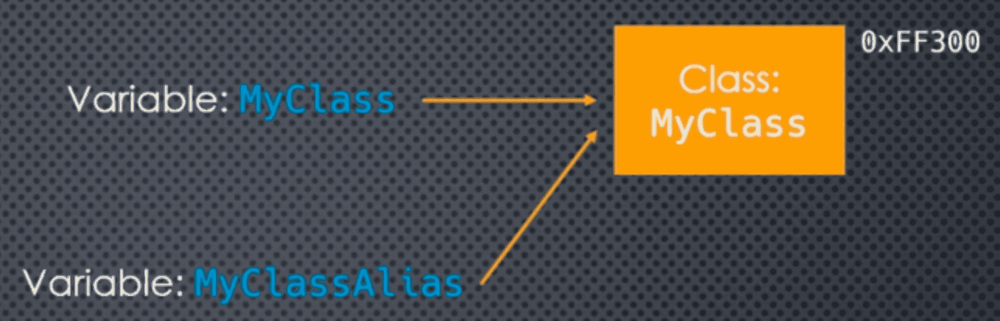

### Tuples as Data Structure

We have seen how we interpreted tuples as data structures. The **position** of the object contained in the tuple gave it **meaning**. For example, we can represent a 2D coordinate as: ```(10, 20)```

If ```pt``` is a position tuple, we can retrieve the ```x``` and ```y``` coordinates using: ```x, y = pt```

So, for example, to calculate the distance of ```pt``` from the origin we could write: ```dist = math.sqrt(pt[0] ** 2 + pt[1] ** 2)```

Now this is not very readable, and if someone sees this code they will have to know that means the x-coordinate and ```pt[1]``` means the y-coordinate. This is not very transparent.

___
### Using a Class instead

At this point, in order to make things clearer for the reader (not the compiler, the reader), we might want to approach this using a class instead.

```python
from math import sqrt

class Point2D:
    def __init__(self, x, y):
        self.x = x 
        self.y = y 

pt = Point2D(10, 20)
distance = sqrt(pt.x ** 2 + pt.y ** 2)
```

```python
class Stock:
    def __init__(self, symbol, year, month, day, open_, high, low, close):
        self.symbol = symbol
        self.year = year
        self.month = month
        self.day = day 
        self.open_ = open_
        self.high = high
        self.low = low 
        self.close = close
```
#### Extra Stuff

At the very least we should implement the ```__repr__``` method -> ```Poinnt(x=10, y=20)``

We probably should implement the ```__eq__``` method too -> ```Point(10, 20) == Point(10, 20) -> True```

```python
class Point2D:
    def __init__(self, x, y):
        self.x = x 
        self.y = y 

    def __repr__(self):
        return f'Point2D(x={self.x}, y={self.y})'

    def __eq__(self, other):
        if isinstance(other, Point2D):
            return self.x == other.x and self.y == other.y 
        else:
            return False
```

___
### Named Tuples to the Rescue 

There are other reasons to seek another approach. Can check them in **Coding Example** section. 

Amongst other things, Point2D objects are **mutable** - something we may not want! There's a lot to like using tuples to represent simple data structures. The real drawback is that we have to know what the positions mean, and remember this in our code.

If we ever need to change the structure of our tuple in our code (like inserting a value that we forgot) most likely our code will break! 

```python
eric = ('Idle', 42)
last_name, age = eric 

# If we change this to 
eric = ('Eric', 'Idle', 42)
last_name, age = eric # is broken
```

Now, if we use the Class approach:

```python
last_name = eric.last_name
age = eric.age
```

So what if we could somehow combine these two approaches, essentially creating tuples where we can in addition, give meaningful names to the position?

That's what ```namedtuple``` essentially do. They **subclass** ```tuple```, and add a layer to assign **property names** to the **positional** elements. Located in the ```collections``` standard library module. We can use them ```from collections import namedtuple```

```namedtuple``` is a **function** that **generates** a new **class** -> a class factory

- That new class **inherits** from tuple 
- But also provides **named properties** to access elements of the tuple 
- But an instance of that class **is** still a **tuple** 

___
### Generating Named Tuple Classes

We have to understand that ```namedtuple``` is a **class factory**. 

When we use it, we are essentially **creating a new class**, just as if we had used ```class``` ourselves. ```namedtuple``` needs a few things to generate this class: 

- The **class name** we want to use 
- A sequence of **field names (strings)** we want to assign, in the **order** of the elements in the tuple 
    - Field names can be any **valid** variable name 
    - Except that they **cannot** start with an **underscore**

The **return** value of the call to ```namedtuple``` will be a **class**. We need to assign that class to a variable name in our code so we can use it to construct instances.

In general, we use the same name as the name of the class that was generated. ```Point2D = namedtuple('Point2D' ,['x', 'y'])```

We can create **instances** of ```Point2D``` just as we would with any class (since it **is** a class). ```pt = Point2D(10, 20)```

The variable name that we use to assign to the class generated and returned by ```namedtuple``` is arbitrary.

```python
from collections import namedtuple

Pt2D = namedtuple('Point2D', ['x', 'y'])
pt = Pt2D(10 ,20)
```

It is no different than the following:



```python
class MyClass:
    pass

MyClassAlis = MyClass

instance_1 = MyClass()
instance_2 = MyClassAlis()
```

Similarly, ```Pt2DAlias = namedtuple('Point2D', ['x', 'y'])```

This is the same concept as aliasing a function, or assigning a lambda function to a variable name!


There are many ways we can provide the list of field names to the ```namedtuple``` function 

- A list of string 
- A tuple of strings *in fact any sequence, just remember that order matters!*
- A single string with the field names separated by whitespace or commas

```python
namedtuple('Point2D', ['x', 'y'])
namedtuple('Point2D', ('x', 'y'))
namedtuple('Point2D', 'x, y')
namedtuple('Point2D', 'x y')
```

___
### Instantiating Named Tuples
 
After we have created a named tuple class, we can Instantiate them just like an ordinary class. 

In fact, the ```__new__``` method of the generated class uses the **field names** we provided as param names.

```Point2D = namedtuple('Point2D', 'x y')```

We can use **positional** arguments: ```pt1 = Point2D(10, 20)``` 10 -> x, 20 -> y

And even **keyword** arguments: ```pt2 = Point2D(x=10, y=20)``` 10 -> x, 20 -> y 

___
### Accessing Data in a Named Tuple

Since named tuples are also regular tuples, we can still handle them just like any other tuple 

- By index 
- Slicing
- Iterate 

```python
Point2D = namedtuple('Point2D', 'x y')
pt1 = Point2D(10, 20)

print(isinstance(pt1, tuple))
```

But now, in addition, we can also access the data using the field names:

```python
Point2D = namedtuple('Point2D', 'x y')
pt1 = Point2D(10, 20)

print(pt1.x, pt1.y)
```

Since namedtuple generated classes inherit from tuple ```class Point2D(tuple):```

```pt1``` **is** a ```tuple```, and is therefore **immutable**, so ```pt1.x = 100``` will **not** work!

___
### The ```rename``` Keyword-Only Argument for ```namedtuple```

Remember that field names for named tuples must be valid identifiers, but cannot start with an underscore. 

This would **not** work: ```Person = namedtuple('Person', 'name age _ssn)```

```namedtuple``` has a keyword-only argument, ```rename``` that will **automatically rename** any **invalid** field name. (defaults to ```False```)

uses convention: ```_{position in list of field names}```

This **will** now work: ```Person = namedtuple('Person', 'name age _ssn', rename = True)```

And the actual field names would be: ```name age _2```

___
### Introspection

We can easily find out the field names in a namedtuple generated class. class property -> ```_fields```

```Person = namedtuple('Person', 'name age _ssn', rename=True)```

```Person._fields``` -> ('name', 'age', '_2')

Remember that ```namedtuple``` is a **class factory**, i.e. it generates a class. We can actually see what the code for that class is, using the class property ```_source```

```Point2D = namedtuple('Point2D', 'x y')``` ```Point2D._source```

```python
class Point2D(tuple):
    'Point2D(x, y)'

    def __new__(cls, x, y):
        'Create new instance of Point2D(x, y)'
        return _tuple.__new__(_cls, (x, y))

    def __repr__(self):
        'Return a nicely formatted representation string'
        return self.__class__.__name__ + '(x=%r, y=%r)' % self 

    x = _property(_itemgetter(0), doc='Alias for field number 0')
    y = _property(_itemgetter(1), doc='Alias for field number 1')
```

___
### Extracting Named Tuple Values to a Dictionary 

Instance method: ```_asdict()```, that creates a dictionary of all the named values in the tuple. 

```python
Point2D = namedtuple('Point2D', 'x y')
pt1 = Point2D(10, 20)

print(pt1._asdict())
```

___
### Code Example 

```python
class Point3D:
    def __init__(self, x, y, z):
        self.x = x 
        self.y = y 
        self.z = z 
```

```python
from collections import namedtuple

Point2D = namedtuple('Point2D', ['x', 'y'])

pt1 = Point2D(10, 20)
print(pt1.x)
print(pt1.y)
```

```python
pt3d_1 = Point3D(10, 20, 30)
print(pt3d_1)
```

```python
Pt2D = namedtuple('Point2D', ('x', 'y'))

pt2 = Pt2D(10, 20)
print(pt2)
```

```python
Point2D = namedtuple('Point2D', ('x', 'y'))

pt2 = Point2D(10, 20)
print(pt2)
```

```python
pt1 = Point2D(10, 20)
pt2 = Point2D(10, 20)

print(pt1 is pt2)
print(pt1 == pt2)

pt3 = Point3D(10, 20, 30)
pt4 = Point3D(10, 20, 30)

print(pt3 is pt4)
print(pt3 == pt4)
```

```python
class Point3D:
    def __init__(self, x, y, z):
        self.x = x 
        self.y = y 
        self.z = z 

    def __repr__(self):
        return f'{self.__class__.__name__}(x={self.x}, y={self.y}, z={self.z})'

    def __eq__(self, other):
        if isinstance(other, Point3D):
            return self.x == other.x and self.y == other.y and self.z == other.z
        else:
            return False

pt3 = Point3D(10, 20, 30)
pt4 = Point3D(10, 20, 30)

print(pt3 is pt4)
print(pt3 == pt4)
```

```python
pt1 = Point2D(10, 20)
pt2 = Point3D(10, 20, 30)

print(max(pt1))
# print(max(pt2)) -> Will give us an error
```

```markdown
Now we want to implement:

a = a.x, a.y 
b = b.x, b.y 

a.b = a.x * b.x + a.y * b.y
```

```python
def dot_product_3d(a, b):
    return a.x * b.x + a.y + b.y + a.z * b.z

pt1 = Point3D(1, 2, 3)
pt2 = Point3D(1, 1, 1)

print(dot_product_3d(pt1, pt2))
```

```python
a = (1, 2)
b = (1, 1)

list(zip(a, b))

result = sum(e[0] * e[1] for e in zip(a, b))
print(result)
```

```python
def dot_product(a, b):
    return sum(e[0] * e[1] for e in zip(a, b))    

print(dot_product(a, b))

pt1 = Point2D(1, 2)
pt2 = Point2D(1, 1)

print(dot_product(pt1, pt2))
```

```python
Vector3D = namedtuple('Vector3D', 'x y z')
v1 = Vector3D(1, 2, 3)
v2 = Vector3D(1, 1, 1)

print(v1)
print(v2)

print(dot_product(v1, v2))
```

```python
Circle = namedtuple('Circle', 'center_x center_y    radius')

c = Circle(0, 0, 10)
print(c)
print(c.radius)
```

```python
Stock = namedtuple('Stock', '''symbol 
year 
month 
day 
open_ 
high 
low 
close''')

djia = Stock('DJIA', 2018, 1, 25, 26_313, 26_458, 26_260, 26_393)
print(djia)
```

```python
print(djia.close)

for item in djia:
    print(item)
```

```python
p = Point(10, 20)

x, y = p 

print(x, y)
```

```python
symbol, year, month, day, *_, close = djia

print(symbol, year, month, day, close)
print(_)
```

```python
# Person = namedtuple('Person', 'name age _ssh') This will give an error
```

```python
Person = namedtuple('Person', 'name age _ssh', rename=True)

print(Person._fields)
```

```python
print(Point2D._fields)

print(Stock._fields)
```

```python
d = djia._asdict()
print(d)
print(d['symbol'])
```

___

