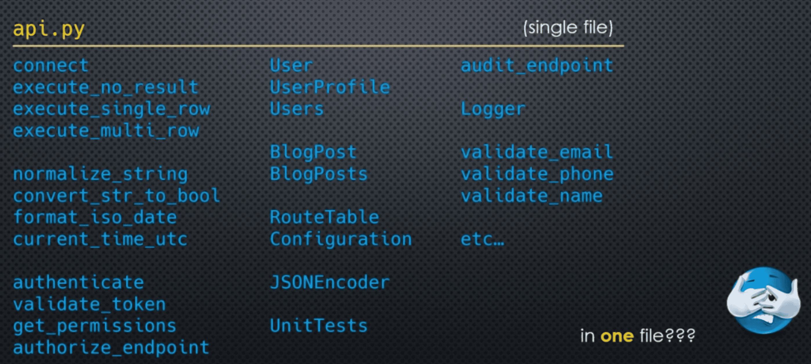
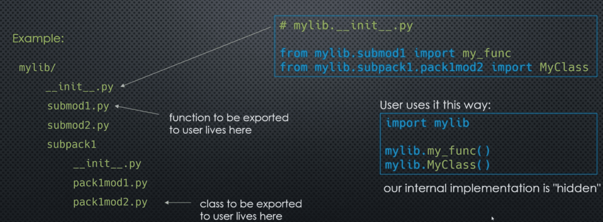

### Code Organization, Ease of Use...

Suppose you have 50 different functions and classes in your program, and you're writing an **API**



___
### Start with Modules...

```markdown
api/
    api.py
    dbutilities.py 
    typeconversions.py
    validations.py
    authentication.py
    authorization.py
    users.py
    blogposts.py
    logging.py
    unittest.py
```

This is better but still unwieldy - everything is at the top level and too many imports:

```markdown
import dbutilities
import jsonutilities
import typeconversions
import validations
import authentication
import authorization
import users 
etc
```

Certain modules could be broken down further:

- **dbutilities**   -> connections, queries
- **users**         -> User, Users, UserProfile

Certain modules belong "together":

- **authentication, authorization** -> security

___
### So, Packages 

```markdown
`api`/
    `utilities`/
        __init__.py
        `database`/
            __init__.py 
            connections.py
            queries.py
        `json`/ 
            __init__.py
            encoders.py
            decoders.py 
    `security/`
        __init__.py
        authorization.py
        authentication.py
    `models`/ 
        __init__.py 
        `users/`
            __init__.py
            user.py
            userprofile.py
```

___
### Another Use Case 

You have a module that implements 2 functions/classes for users of the module. Those two objects require 20 different helper functions and 2 additional helper classes 

**From module developer's perspective:**
    much easier to break the code down into multiple modules 

**From module user's perspective:**
    they just want a single import for the function and the class
    i.e. it should look like a single module 

___
### Module Developer's Perspective 

```markdown
`mylib`/ 
    __init__.py 
    submod1.py  # functionn to be exported to user lives here
    submod2.py 
    `subpack1`/ 
        __init__.py 
        pack1mod1.py 
        pack1mod2.py # class to be exported to user lives here
```

Smaller code modules, with a specific purpose, are easier to write, debug, test, and understand. User should not have to write:

```markdown
from mylib.submod1 import my_func
from mylib.subpack1.pack1mod2 import MyClass
```

Much easier for user if they could write: ```from mylib import my_func, MyClass```, or simply: 

```markdown
import mylib
mylib.my_func()
mylib.MyClass()
```

___
### Using `__init__`.py

We can use packages' `__init__.py` code to export (expose) just what's needed by our users 



___
### So, why Packages 

It gives us the ability to break code up into smaller chunks, making our code: 

- easier to write 
- easier to test and debug
- easier to read/understand
- easier to document 

Just like books are broken down into chapters, sections, paragraphs, etc. But they can still be "stitched" together and can hide inner implementation from users

___

