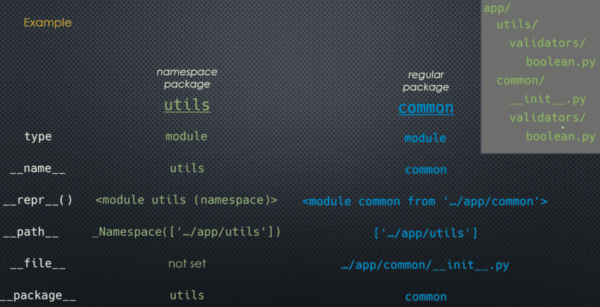

### What are Implicit Namespace Packages

Namespace packages are **package-like** directories:

- may contain modules 
- may contain nested regular packages
- may contain nested namespace packages
- but **cannot contain** `__init__`.py 

The directories are **implicitly** made into these special types of packages [PEP 420](https://peps.python.org/pep-0420/)

___ 
### Mechanics 

```markdown
utils/
    validators/
        boolean.py 
        date.py 
        json/ 
            __init__.py 
            serializers.py 
            validators.py 
```

- utils/ does not contain `__init__`.py -> namespace package 
- validators/ does not contain `__init__`.py -> namespace package 
- boolean.py is a file with a `.py` extension -> module 
- json/ contains `__init__`.py -> regular package 
- serializers.py is a file with a `.py` extension -> module

___
### Regular vs Namespace Packages

| **Regular Package**                                                          | **Namespace Package**                                                                                                           |
| ---------------------------------------------------------------------------- | ------------------------------------------------------------------------------------------------------------------------------- |
| `type` -> module                                                             | `type` -> module                                                                                                                |
| `__init__.py` -> yes                                                         | `__init__.py` -> no                                                                                                             |
| `__file__` -> package `__init__`                                             | `__file__` -> not set                                                                                                           |
| `paths` -> breaks if parent directories change and absolute imports are used | `paths` -> dynamic path computation so OK if parent directories change  (your import statements will still need to be modified) |
| Single package lives in single directory                                     | Single package can live in **multiple** (non-nested) directories. In fact, parts of the namespace may ecen be in a zip file                                                                |

___
### Example 

```markdown
app/
    utils/
        validators/
            boolean.py 
    common/
        __init__.py 
        validators/
            boolean.py
```



___
### Import Examples 

```markdown
utils/ 
    validators/
        boolean.py 
        date.py 
        json/ 
            __init__.py 
            serializers.py 
            validators.py 
```

```markdown
import utils.validators.boolean 
from utils.validators import date 
import utils.validators.json.serializers
```

First, familiarize yourself with regular packages. Once you are **completely** comfortable with them, check out namespace packages if you want

___
