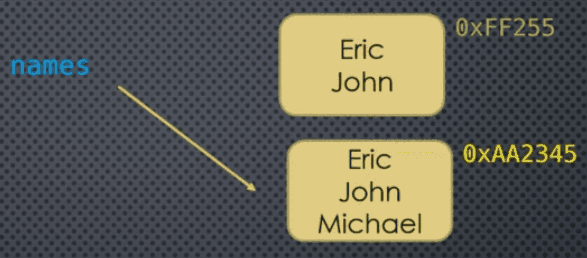

### Mutating Objects 

```python
names = ['Eric', 'John']

names = names + ['Micheal']
```



This is **not** a mutation!

Mutating an object means changing the object's **state** without creating a new object

```python
names = ['Eric', 'John']

names.append('Micheal')
```


___
### Mutating Using `[]`

```markdown
s[i] = x        # Element at index `i` is replaced with `x`

s[i:j] = s2     # Slice is replaced by the **contents** of the iterable `s2`

del s[i]        # removes element at index `i`

del s[i:j]      # removes entire slice  

s[i:j:k] = s2   # We can even assign to extended slices
```

___
### Mutable Sequence Types: `list`

```markdown
s.clear()       # removes all items from `s`

s.append(x)     # appends `x` to the end of `s`

s.insert(i, x)  # insert `x` at index `i`

s.extend(iterable) # appends contents of `iterable` to the end of `s`

s.pop(i)        # removes and returns element at index `i`

s.remove(x)     # removes the first occurrence of `x` in `s`

s.reverse()     # does an **in-place** reversal of elements of `s`

s.copy()        # returns a **shallow** copy
```

___
### Code Example

When dealing with mutable sequences, we have a few more things we can do - essentially adding, removing, and replacing elements in the sequence.

This **mutates** the sequence. The sequence's memory address has not changed, but the internal **state** of the sequence has.
#### Replacing Elements

We can replace a single element as follows:

```python
l = [1, 2, 3, 4, 5]
print(id(l))
l[0] = 'a'
print(id(l), l)
```

We can remove all elements from the sequence:

```python
l = [1, 2, 3, 4, 5]
l.clear()
print(l)
```

Note that this is **NOT** the same as doing this:

```python
l = [1, 2, 3, 4, 5]
l = []
print(l)
```

The net effect may look the same, `l` is an empty list, but observe the memory addresses:

```python
l = [1, 2, 3, 4, 5]
print(id(l))
l.clear()
print(l, id(l))
```

VS

```python
l = [1, 2, 3, 4, 5]
print(id(l))
l = []
print(l, id(l))
```

In the second case, you can see that the object referenced by `l` has changed, but not in the first case.

Why might this be important?

Suppose you have the following setup:

```python
suits = ['Spades', 'Hearts', 'Diamonds', 'Clubs']
alias = suits
suits = []
print(suits, alias)
```

```python
suits = ['Spades', 'Hearts', 'Diamonds', 'Clubs']
alias = suits
suits.clear()
print(suits, alias)
```

Big difference!!

We can also replace elements using slicing and extended slicing. Here's an example, but we'll come back to this in a lot of detail:

```python
l = [1, 2, 3, 4, 5]
print(id(l))
l[0:2] = ['a', 'b', 'c', 'd', 'e']
print(id(l), l)
```
#### Appending and Extending

We can also append elements to the sequence (note that this is **not** the same as concatenation):

```python
l = [1, 2, 3]
print(id(l))
l.append(4)
print(l, id(l))
```

If we had "appended" the value `4` using concatenation:

```python
l = [1, 2, 3]
print(id(l))
l = l + [4]
print(id(l), l)
```

If we want to add more than one element at a time, we can extend a sequence with the contents of any iterable (not just sequences):

```python
l = [1, 2, 3, 4, 5]
print(id(l))
l.extend({'a', 'b', 'c'})
print(id(l), l)
```

Of course, since we extended using a set, there was no guarantee of positional ordering.

If we extend with another sequence, then positional ordering is retained:

```python
l = [1, 2, 3]
l.extend(('a', 'b', 'c'))
print(l)
```
#### Removing Elements

We can remove (and retrieve at the same time) an element from a mutable sequence:

```python
l = [1, 2, 3, 4]
print(id(l))
popped = l.pop(1)
print(id(l), popped, l)
```

If we do not specify an index for `pop`, then the **last** element is popped:

```python
l = [1, 2, 3, 4]
popped = l.pop()
print(popped)
print(id(l), popped, l)
```
#### Inserting Elements

We can insert an element at a specific index. What this means is that the element we are inserting will be **at** that index position, and the element that was at that position and all the remaining elements to the right are pushed out:

```python
l = [1, 2, 3, 4]
print(id(l))
l.insert(1, 'a')
print(id(l), l)
```
#### Reversing a Sequence

We can also do in-place reversal:

```python
l = [1, 2, 3, 4]
print(id(l))
l.reverse()
print(id(l), l)
```

We can also reverse a sequence using extended slicing (we'll come back to this later):

```python
l = [1, 2, 3, 4]
l[::-1]
```

But this is **NOT** mutating the sequence - the slice is returning a **new** sequence - that happens to be reversed.

```python
l = [1, 2, 3, 4]
print(id(l))
l = l[::-1]
print(id(l), l)
```
#### Copying Sequences

We can create a copy of a sequence:

```python
l = [1, 2, 3, 4]
print(id(l))
l2 = l.copy()
print(id(l2), l2)
```

Note that the `id` of `l` and `l2` is not the same.

In this case, using slicing does work the same as using the `copy` method:

```python
l = [1, 2, 3, 4]
print(id(l))
l2 = l[:]
print(id(l2), l2)
```

As you can see in both cases we end up with new objects.

So, use copy() or [:] - up to you, they end up doing the same thing.

We'll come back to copying in some detail in an upcoming video as this is an important topic with some subtleties.

___

